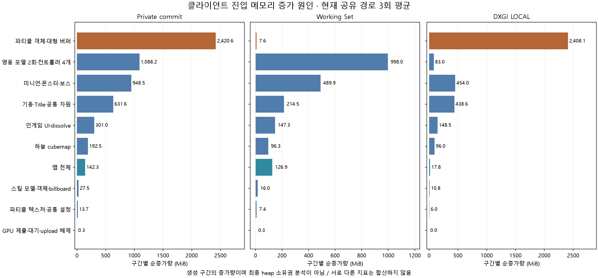
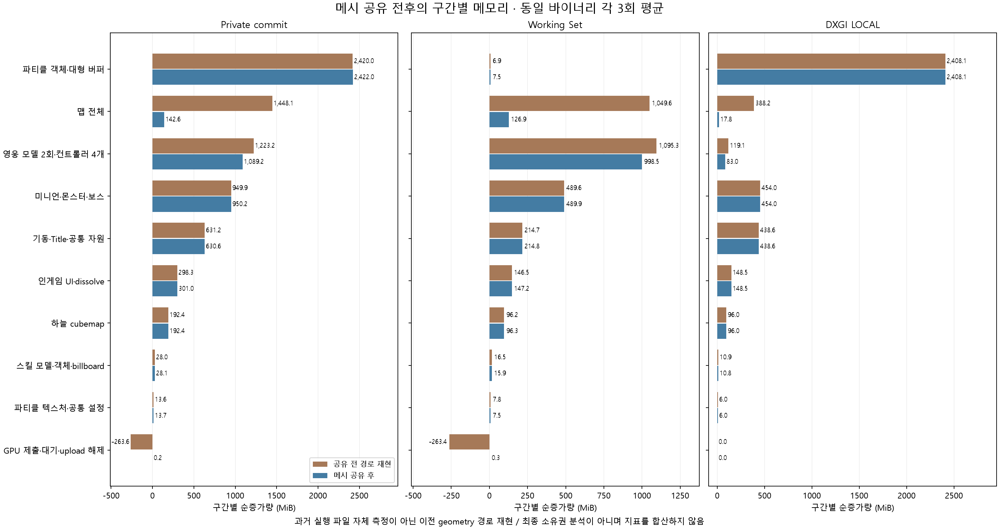

# 클라이언트 메모리 증가 원인과 메시 공유 전후 비교

> 아래는 영웅 선택 외형·파티클 최적화 이전의 기록이다. [공용 풀 적용 당시 3회 메모리 비율](PARTICLE_BUFFER_POOL.md#최적화-후-클라이언트-메모리-구성-비율), [DDS 공유 적용](NPC_RESOURCE_SHARING_REVIEW.md#후속-적용-모델-dds-공유), 최신 [NPC upload·BC7·상수 arena의 전후 3회 실측](NPC_MEMORY_OPTIMIZATION.md)을 구분해 참고한다. 아래의 upload 순회 누락은 최신 구현에서 보완했다.

## 결론과 측정 범위

**현재 가장 큰 증가 원인은 파티클 풀이다. 맵 전체 생성 구간의 비중은 약 2.5%다.** 메시 공유 전에는 맵이 큰 원인이었지만, 공유 후에는 파티클의 과도한 최대 용량과 캐릭터/텍스처 비용이 남았다.

앞선 5,768MiB는 약 5.63GiB의 **프로세스 private commit**이었다. 실제 RAM에 상주한 Working Set이나 CPU heap만의 크기를 뜻하지 않는다. 2026-10-05 KST의 이번 세부 계측에서 3회 평균은 private commit **5,766.11MiB**, Working Set **2,104.25MiB**, DXGI LOCAL **3,662.88MiB**, NON_LOCAL **815.71MiB**다. 계측 추가에 따른 재측정이며 새로운 최적화 성과가 아니다.

지표 정의는 Microsoft의 [프로세스 메모리 카운터](https://learn.microsoft.com/en-us/windows/win32/api/psapi/ns-psapi-process_memory_counters_ex)와 [DXGI 사용량](https://learn.microsoft.com/en-us/windows/win32/api/dxgi1_4/ns-dxgi1_4-dxgi_query_video_memory_info)을 따른다. [자원 할당 정보](https://learn.microsoft.com/en-us/windows/win32/api/d3d12/nf-d3d12-id3d12device-getresourceallocationinfo%28uint_uint_constd3d12_resource_desc%29)는 해당 adapter의 크기·정렬 요구량이며 실제 residency와 구분한다.

Release x64/RTX 4070 SUPER에서 동일 Title→INGAME 시나리오를 독립 프로세스 3회 실행했다. 네트워크·loading render thread·전투 프레임은 기존 A/B와 동일하게 제외했다. 장면 생성 checkpoint를 세분화하고 실제 파티클 생성 수·buffer Width·`GetResourceAllocationInfo`를 수집했다.

## 실측 비용 분해

아래는 **각 생성 구간의 순증가량 평균**이다. 초기화 행에는 프로세스 기동 기준값도 포함하여 순증가량 합계가 최종 값과 일치하도록 했다. 해제·allocator 재사용·driver 계상 때문에 각 행을 최종 시점에 해당 자원이 단독 소유한 메모리로 해석하지 않는다. 지표별 합계는 각각 검증했고 서로 다른 지표는 합산하지 않는다.

| 생성 구간 | private commit 증가 | 전체 증가분 비중 | Working Set 증가 | DXGI LOCAL 증가 |
|---|---:|---:|---:|---:|
| 파티클 객체·대형 버퍼 | **2,420.57MiB** | **41.98%** | 7.60MiB | **2,408.15MiB** |
| 영웅 모델 2회·컨트롤러 4개 | **1,088.22MiB** | **18.87%** | 998.02MiB | 82.96MiB |
| 미니언·몬스터·Ogre boss | **948.46MiB** | **16.45%** | 489.88MiB | 453.98MiB |
| 기동·Title·공통 자원 | 631.60MiB | 10.95% | 214.48MiB | 438.64MiB |
| 인게임 UI·dissolve | 300.97MiB | 5.22% | 147.29MiB | 148.51MiB |
| 하늘 cubemap | 192.51MiB | 3.34% | 96.31MiB | 96.00MiB |
| **맵 전체 생성** | **142.32MiB** | **2.47%** | **126.92MiB** | **17.80MiB** |
| 스킬 모델·객체·billboard | 27.52MiB | 0.48% | 16.04MiB | 10.84MiB |
| 파티클 텍스처·공통 설정 | 13.68MiB | 0.24% | 7.43MiB | 6.00MiB |
| GPU 제출·대기·upload 해제 | 0.25MiB | 0.00% | 0.26MiB | 0.00MiB |
| **최종 평균** | **5,766.11MiB** | **100%** | **2,104.25MiB** | **3,662.88MiB** |

표는 반올림으로 합계에 작은 차이가 있을 수 있다. byte 단위 근거에서는 각 실행의 구간 합계가 최종 값과 정확히 일치한다. private commit의 3회 범위는 5,762.95~5,770.43MiB, 중앙값은 5,764.96MiB다. 이전 중앙값 5,768.31MiB와 통계/실행이 다르므로 추가 절감으로 표시하지 않는다.



[JSON 근거](evidence/client-memory-breakdown-20261005.json) · [CSV](evidence/client-memory-breakdown-20261005.csv) · [SVG](evidence/figures/client-memory-breakdown.svg). bf7b4cee 기반 미커밋 계측 작업 트리에서 측정했으며 실행 파일/측정 소스 SHA-256, 각 실행의 checkpoint·구간 차이·반복 통계를 보존했다. 기존 A/B 근거는 덮어쓰지 않았다.

## 후속 실측: 메시 공유 전에는 각각 얼마였나?

위 현재 경로 3회와 별개로, **같은 Release 실행 파일에서 legacy/shared를 각 3회 교대 실행**했다. 순서는 이전→현재→현재→이전→이전→현재이며 같은 checkpoint·모델·선택 스킬·GPU를 사용했다. 기존 근거는 보존하고 새 측정 묶음으로 전후를 비교했다.

`legacy`는 초기 커밋 ed3428e의 메시 공유 전 geometry 로딩 방식을 **현재 바이너리에서 재현**한다. 과거 commit 실행 파일 자체나 모든 과거 게임 동작을 측정한 결과는 아니다. 두 모드 모두 같은 Title→INGAME 경로와 영웅 모델 2회·컨트롤러 4개·Ogre boss·파티클 131개를 사용한다. 새 최적화는 적용하지 않았다.

다음 표의 모든 수치는 **구간별 순증가량, 각 모드 3회 평균, MiB**다. Private commit·Working Set·DXGI LOCAL은 서로 합산하지 않는다.

| 생성 구간 | Private 공유 전 | Private 공유 후 | Working Set 전→후 | DXGI LOCAL 전→후 |
|---|---:|---:|---:|---:|
| 파티클 객체·대형 버퍼 | **2,419.96** | **2,422.04** | 6.91→7.46 | **2,408.15→2,408.15** |
| **맵 전체 생성** | **1,448.13** | **142.62** | **1,049.64→126.92** | **388.25→17.80** |
| 영웅 모델 2회·컨트롤러 4개 | **1,223.24** | **1,089.20** | 1,095.34→998.46 | 119.07→82.96 |
| 미니언·몬스터·Ogre boss | 949.93 | 950.18 | 489.64→489.90 | 453.98→453.98 |
| 기동·Title·공통 자원 | 631.20 | 630.65 | 214.74→214.79 | 438.64→438.64 |
| 인게임 UI·dissolve | 298.33 | 301.05 | 146.52→147.25 | 148.51→148.51 |
| 하늘 cubemap | 192.42 | 192.42 | 96.23→96.28 | 96.00→96.00 |
| 스킬 모델·객체·billboard | 28.00 | 28.12 | 16.45→15.93 | 10.95→10.84 |
| 파티클 텍스처·공통 설정 | 13.60 | 13.71 | 7.81→7.50 | 6.00→6.00 |
| **GPU 제출·대기·upload 해제** | **−263.63** | **0.25** | **−263.43→0.27** | 0.00→0.00 |
| **최종 평균** | **6,941.19** | **5,770.25** | **2,859.86→2,104.74** | **4,069.55→3,662.88** |

맵 생성 구간의 private commit 증가량은 **1,305.51MiB(90.15%)**, 영웅 구간은 **134.04MiB(10.96%)** 줄었다. 공유 전에도 파티클이 가장 큰 구간이었다. 맵이 그다음으로 컸고 메시 공유의 주요 개선 대상이었던 기억은 맞다. 파티클 GPU 증가량·개수·대형 버퍼 할당 정보는 양 모드가 같으며, 영웅의 애니메이션 행렬 중복 약 668.24MiB도 그대로다. NPC·UI·파티클 등의 작은 private/Working Set 차이는 이번 계측만으로 기능 변경이나 성능 회귀로 해석하지 않는다.

**맵/영웅 생성 구간 감소량을 더한 값을 최종 절감량으로 쓰면 안 된다.** 이전 방식은 GPU 제출·대기·기존 upload 해제 구간에서 private commit 평균 263.63MiB, Working Set 263.43MiB가 감소했다. 현재 방식은 이 구간의 private commit이 거의 변하지 않는다. 이전 방식에서 더 많이 생성했던 임시 자원이 진입 끝에 해제되는 경로와 allocator/driver 계상이 포함되므로, 생성 직후 증가량과 최종 남은 비용은 다르다. 구간별 차이에는 이 음수 행을 포함했고 각 실행의 합계가 최종 값과 byte 단위로 일치한다.

최종 전후 차이는 private commit **1,170.94MiB(16.87%)**, Working Set **755.11MiB(26.40%)**, LOCAL **406.67MiB(9.99%)**다. NON_LOCAL 평균은 **853.38→815.71MiB**였다. 이전 첫 A/B의 중앙값과 이번 평균은 별도 실행·통계이므로 숫자가 조금 다른 것을 추가 최적화 성과로 표시하지 않는다. 이번 private commit 범위는 이전 6,923.44~6,951.82MiB, 현재 5,764.94~5,777.21MiB다.



[전후 JSON 근거](evidence/client-memory-stage-comparison-20261005.json) · [전체 지표 CSV](evidence/client-memory-stage-comparison-20261005.csv) · [SVG](evidence/figures/client-memory-stage-comparison.svg). 구간별/최종 평균·중앙값·최솟값·최댓값, 모드별 checkpoint, 실행 파일과 소스 SHA-256을 보존했다. 보고서 도구의 `--compare`로 재현한다.

```powershell
./scripts/Measure-ClientMemory.ps1 -Configuration Release -Runs 3 -OutputDirectory artifacts/logs/client-memory-stage-comparison
python ./scripts/Build-ClientMemoryBreakdown.py --compare --summary artifacts/logs/client-memory-stage-comparison/summary-Release.json --output artifacts/logs/client-memory-stage-comparison-report.json
# --charts 추가 시 matplotlib 필요
```

6회 완료·모드별 3회·교대 순서·동일 파티클 시나리오·소스/실행 파일 해시·구간 합계·보고서 재생성 일치 PASS. 모드 누락, 미완료, checkpoint 누락, 버퍼 용량 불일치, 시나리오 변경, 중복 실행 번호, baseline 불일치 입력 거부도 PASS. 클라이언트 C++/바이너리는 직전 Debug/Release 검증 때와 같아 이번에는 게임 빌드를 반복하지 않았다. 전투·로그인/로비 경유·장시간 누수는 이 비교의 범위가 아니다.

## 파티클: 진입 시 약 2.4GiB를 미리 확보

실제 생성 수는 **131개**, 실제 vertex stride는 **32bytes**, 각 객체의 최대 용량은 **300,000개**다. stream-output/draw 용도에 각각 같은 최대 크기의 DEFAULT buffer를 만든다.

| 그룹 | 실제 객체 수 | private commit 증가 평균 | DXGI LOCAL 증가 평균 |
|---|---:|---:|---:|
| 전체 스킬의 사전 풀 | 100개 | 1,847.55MiB | 1,838.28MiB |
| 이번 시나리오의 선택 스킬 효과 | 12개 | 221.83MiB | 220.59MiB |
| 점프 6개·코인 9개·경계 4개 | 19개 | 351.19MiB | 349.27MiB |

```text
실제 대형 buffer Width의 합
= 131 × 300,000 × 32bytes × 2
= 2,515,200,000bytes = 2,398.68MiB

device.GetResourceAllocationInfo의 합
= 2,524,053,504bytes = 2,407.13MiB
```

LOCAL 실측 증가 2,408.15MiB가 대형 버퍼 할당 정보와 가깝다. 작은 초기 정점·카운터·기타 버퍼는 대형 버퍼 합계에서 제외했다. 객체는 각 풀/장면 컨테이너에 유지된다. counter는 누적 생성 수이며 일반적인 live resource/leak 추적기는 아니다.

이 구간에서 Working Set은 7.60MiB만 늘었다. 따라서 파티클이 CPU RAM에서 2.4GiB, GPU에서 별도로 2.4GiB를 쓴다고 해석하면 안 된다. DEFAULT 자원 생성 구간에서 private commit과 LOCAL이 함께 증가한 사실을 관측했다. OS/driver 계상의 상세 원인을 heap 소유권 단위로 추적한 결과는 아니다.

실제 발생 수·표시 여부와 관계없이 처음부터 최대 버퍼를 확보하고, 사용하지 않는 직업/스킬의 풀까지 함께 생성한다. 효과별 최대 용량·선택 스킬만 생성·지연 생성·동시 개수에 따른 풀 크기가 첫 번째 개선 후보다. 이번에는 최적화를 적용하지 않았다.

## 맵이 큰 원인이 아니었나?

**공유 전에는 맞았고 공유 후에는 크게 줄었다.** 기존 A/B에서 Plane1 로딩 시작~다음 미니언 모델 로딩 시작 구간의 중앙값은 다음과 같다. CMap의 프레임/material CB 생성도 포함한다.

| 맵 전체 생성 구간, 기존 3회 측정 | 이전 geometry 경로 재현 | 현재 공유 경로 |
|---|---:|---:|
| private commit 증가 | **1,449.34MiB** | **142.00MiB** |
| Working Set 증가 | 1,050.00MiB | 126.88MiB |
| DXGI LOCAL 증가 | 388.25MiB | 17.80MiB |

이는 맵 geometry CPU 배열 계산 313.54→8.81MiB와 다른 범위다. 현재 세부 checkpoint의 전체 맵 평균 142.32MiB는 위 결과와 가깝다. geometry가 8.81MiB라는 이유로 전체 맵을 8.81MiB라고 설명하지 않는다.

맵은 5,594개 frame과 5,897개 material slot 및 개별 CB를 유지한다. 앞서 계산한 CB의 64KiB 할당 모델 718.31MiB도 실측 private commit 증가 142MiB와 같은 지표가 아니며 비용표에 더하면 안 된다. [맵 목록과 에셋 계산](CLIENT_MEMORY_OPTIMIZATION.md)을 참조한다.

## 나머지 큰 비용과 upload 해제 범위

- 영웅 생성 구간은 private commit 약 1,088MiB, Working Set 약 998MiB다. 두 모델 로딩에 동일 애니메이션 행렬 약 668.24MiB가 중복된다. geometry 공유 후에도 스키닝·애니메이션·텍스처·컨트롤러·프레임/material CB가 남는다.
- 미니언/몬스터/boss 약 948MiB에는 texture DEFAULT 자원과 임시 upload, 모델/애니메이션/컨트롤러가 포함된다. Minotaur의 texture 6장만 픽셀 payload 240MiB다.
- 공통 초기화 약 632MiB에는 Direct3D/UI/Title, render target·blur·음원·shadow map이 포함된다. `CreateShadowMap()`은 실제로 **8192×8192, 32bit 계열** 자원을 만든다. 논리 texel 용량은 256MiB다. 음원 초기화 구간의 private commit 증가 평균은 약 125.75MiB였다.
- UI/dissolve 약 301MiB에는 당장 보이지 않는 상점·아이템·스킬·승리/패배 화면 등의 초기화가 포함된다. LOCAL 증가 약 148.51MiB와 Working Set 증가 약 147.29MiB도 따로 기록했다.

`ChangeScene()`은 GPU fence 후 scene/player의 `ReleaseUploadBuffers()`를 호출한다. 하지만 `CIngameScene::ReleaseUploadBuffers()`는 skybox·기본 객체/셰이더 배열·맵 hierarchy·billboard만 순회하며 **전용 minion/monster/OtherClient/tower/skill/particle 컨테이너를 직접 순회하지 않는다.** 인게임 texture shader와 dissolve도 이 호출 목록에 없다. 이런 별도 소유 컨테이너에 임시 upload가 장면 유지 기간 동안 남는 경로가 있으므로 해제 범위를 후속 점검 대상으로 확인했다. 계속 갱신하는 UPLOAD CB와 일회성 texture/vertex upload는 구분해야 한다.

GPU 완료 직후→기존 upload 해제 후 NON_LOCAL은 평균 **170.53MiB 감소**했지만 private commit은 거의 변하지 않았다. 최종 NON_LOCAL 815.71MiB를 전부 불필요 upload라고 부르지 않는다. 유지해야 하는 CB도 포함되며 자원별 최종 잔존량을 모두 분리한 측정은 아니다. 이번 분석에서는 해제 로직을 변경하지 않았다.

## 개선 순서·재현·검증

GPU/private commit 감소의 첫 후보는 **파티클 용량/풀 정책**, CPU Working Set 감소의 첫 후보는 **immutable animation clip 공유**다. 이어서 임시 upload 해제 경로, texture format/해상도/재사용, UI 필요 시 로딩, shadow map 해상도, 작은 CB suballocation을 검토한다. 실제 수정 후 동일 시나리오 재측정과 각 기능 correctness 검증을 진행한다.

```powershell
./scripts/Build.ps1 -Configuration Release -Module Client
./scripts/Measure-ClientMemory.ps1 -Configuration Release -Runs 3 -Modes shared -OutputDirectory artifacts/logs/client-memory-breakdown
python ./scripts/Build-ClientMemoryBreakdown.py --summary artifacts/logs/client-memory-breakdown/summary-Release.json --output artifacts/logs/client-memory-breakdown-report.json
# --charts: matplotlib 필요. --historical-summary: 기존 A/B raw summary로 맵도 비교.
```

이전 소스와 실행 파일도 로컬 artifacts에 보관했다. Release/Debug 클라이언트 빌드, 양 구성의 메시 공유 12개 검사·실제 에셋 GPU 감사·일반 로컬 시작 smoke test PASS. 계측은 명시적 CLI에서만 활성이다. 3회 개수·용량/stride 일치, byte 단위 구간 합계/최종 값 일치, 현재 측정 소스 9개·과거 보관 소스 11개·실행 파일의 SHA-256을 검사했다. 보고서 재생성 결과 일치와 미완료/누락 checkpoint/불일치 파티클 용량/잘못된 실행 횟수 거부도 PASS. 로그인/로비 경유 이력·다른 선택 스킬·다른 boss·장시간 전투의 최대 메모리는 이번 결과에 포함하지 않는다.

코드 근거: [Scene.cpp](../../Client/WarOfDimension/Scene.cpp), [Mesh.cpp](../../Client/WarOfDimension/Mesh.cpp), [Mesh.h](../../Client/WarOfDimension/Mesh.h), [GameFramework.cpp](../../Client/WarOfDimension/GameFramework.cpp), [ShadowMap.cpp](../../Client/WarOfDimension/ShadowMap.cpp), [ClientMemoryProfile.cpp](../../Client/WarOfDimension/ClientMemoryProfile.cpp), [보고서 도구](../../scripts/Build-ClientMemoryBreakdown.py).
