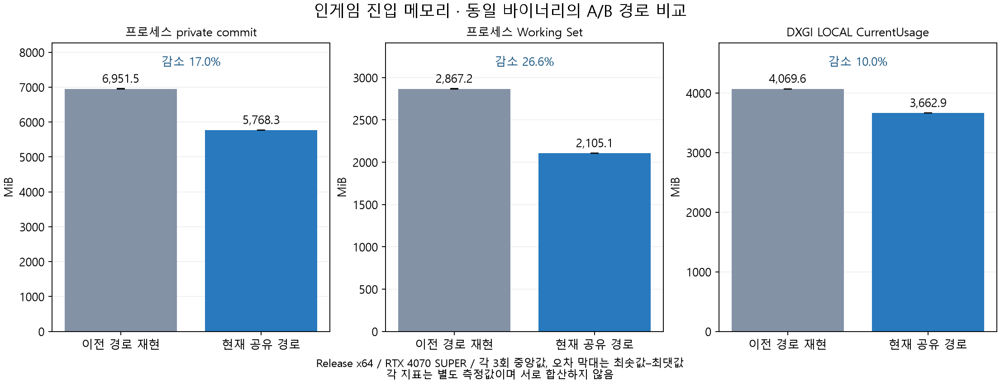
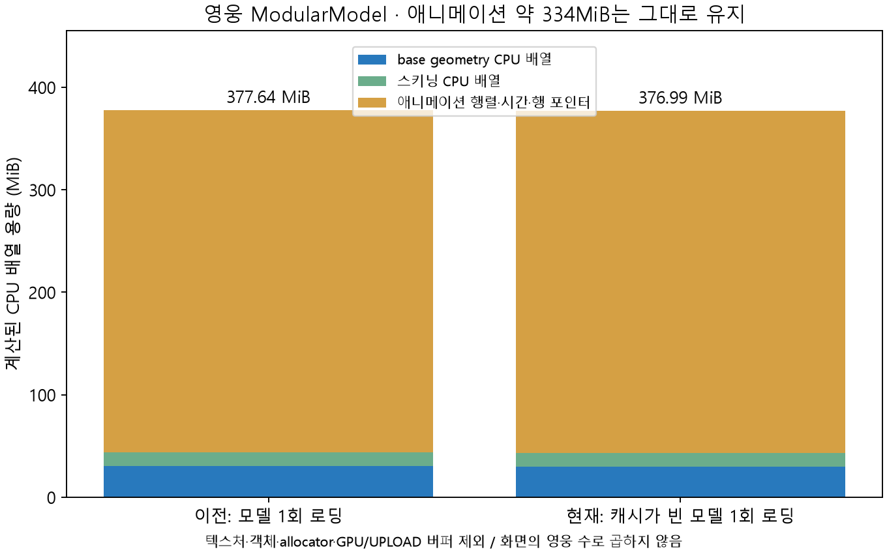

# 클라이언트 메시 공유와 인게임 진입 메모리 최적화

## 결과

현재 전체 메모리의 비용 분해는 후속 [메모리 증가 원인 분석](CLIENT_MEMORY_BREAKDOWN.md)에 있다. 맵 geometry와 전체 맵 생성 비용을 구분하고, 실제 파티클 131개의 대형 버퍼가 가장 큰 증가 원인임을 추가 계측했다. 아래 A/B 수치와 기존 근거는 그대로 보존한다.

이후 동일한 세부 checkpoint로 legacy/shared를 각 3회 교대 실행한 [구간별 전후 비교](CLIENT_MEMORY_BREAKDOWN.md#후속-실측-메시-공유-전에는-각각-얼마였나)도 추가했다. 맵·영웅·파티클·NPC·UI 및 진입 마지막 해제 구간까지 분리했다. 이 후속 평균과 아래 최초 A/B 중앙값은 별도 측정이므로 혼합하지 않는다.

같은 geometry를 프레임마다 생성하던 로더를 내용 기반 공유 캐시로 변경했다. 이름이 다른 동일 geometry도 하나의 CPU 배열과 D3D12 base geometry를 사용한다. 정적 프레임의 transform·material과 스킨드 메시의 본·애니메이션 상태는 기존 소유권을 유지한다.

2026-10-05 KST, Release x64에서 **이전 geometry 로딩 경로를 현재 바이너리에 재현한 A/B 측정**을 각각 3회 실행했다. 인게임 진입 완료 시 중앙값은 다음과 같다. **과거 커밋의 실행 파일을 직접 측정한 결과가 아니다.**

| 지표 | 개선 전 경로 재현 | 현재 공유 경로 | 감소량 | 감소율 |
|---|---:|---:|---:|---:|
| 프로세스 private commit | 6,951.54MiB | 5,768.31MiB | 1,183.22MiB | 17.02% |
| 프로세스 Working Set | 2,867.15MiB | 2,105.12MiB | 762.04MiB | 26.58% |
| DXGI LOCAL CurrentUsage | 4,069.55MiB | 3,662.88MiB | 406.67MiB | 9.99% |
| DXGI NON_LOCAL CurrentUsage | 853.38MiB | 815.96MiB | 37.42MiB | 4.39% |
| 로딩 중 private commit 피크¹ | 7,207.73MiB | 5,768.31MiB | 1,439.42MiB | 19.97% |
| 진입 완료까지의 PeakWorkingSet | 3,146.32MiB | 2,128.63MiB | 1,017.69MiB | 32.35% |

¹ 외부 프로세스에서 약 50ms 간격으로 표본화한 최댓값이다. 짧은 피크를 놓칠 수 있다. PeakWorkingSet은 OS가 보관하는 해당 프로세스의 최대 Working Set이다. 진입 완료 수치와 로딩 중 피크를 구분한다.



[JSON 근거](evidence/client-memory-20261005.json)는 각 실행의 byte 단위 수치·최솟값·최댓값·중앙값, 모델별 계산값, 에셋/측정 소스/실행 파일 SHA-256을 포함한다. [CSV](evidence/client-memory-20261005.csv), [인게임 그래프 SVG](evidence/figures/ingame-memory.svg), [영웅 그래프 SVG](evidence/figures/hero-cpu-payload.svg)는 포트폴리오에 재사용할 수 있다. 개인 경로·PID·일반 실행 로그는 근거 파일에 넣지 않았다.

## 문제와 분석

원래 로더는 모델 hierarchy의 `<Mesh>:` 레코드마다 CPU 배열과 GPU 버퍼를 만들었다. 맵 안의 반복 오브젝트는 위치·회전·크기만 다르지만 같은 geometry를 수천 번 보유했다. 영웅의 일부 부품은 이름만 다른 동일 geometry였으며, 동일 모델 파일을 다시 로딩할 때도 새 버퍼를 생성했다.

핵심 맵 `Plane1.bin`의 메시 레코드 5,185개 중 geometry 종류는 78개였다. 영웅 `ModularModel.bin`은 724개 중 698개이며 이름이 다른 중복 26개를 확인했다. 따라서 맵에서 먼저 큰 절감이 나타나고, 영웅은 내부 중복 제거보다 **두 번째 모델 로딩의 geometry 재사용**에서 효과가 클 것으로 예상했다.

## 구현과 설계 선택

- 메시 이름을 제외한 geometry 레코드를 SHA-256으로 비교한다. 정점 수·bounds·각 attribute·subset/index가 다르면 공유하지 않는다. 해시·내용 길이·D3D12 device로 캐시 키를 구성한다.
- CPU 배열과 GPU base geometry는 공유하고 프레임의 transform·material은 유지한다. 스킨드 메시 wrapper는 분리하며 본 index/weight·bind-pose·본 프레임 연결·컨트롤러 상태는 이번 공유 범위에서 제외한다.
- weak_ptr 캐시로 마지막 실제 소유자가 사라지면 geometry가 해제되도록 한다. 객체의 shared 소유권과 기존 참조 수를 연결하고 동시 최초 로딩도 보호한다.
- 가변 UI·파티클·procedural mesh는 캐시에 넣지 않는다. GPU 업로드 완료와 임시 upload buffer 해제는 기존 장면 로딩 경로가 담당한다.

소유권·수명·기기 경계·대안 검토는 [메시 공유 구현 문서](../architecture/MESH_SHARING.md), [검증된 구조도](../diagrams/mesh-sharing/README.md)에 있다. 이번 측정 도구 추가는 공유 구조를 변경하지 않아 기존 구조도 JSON/HTML을 재생성하지 않았다.

## 비교 조건과 측정 지표

| 조건 | 값 |
|---|---|
| 환경 | Windows 11, NVIDIA GeForce RTX 4070 SUPER, driver 32.0.15.9186 |
| 빌드 | Visual Studio 2026/MSVC v145, Release x64 |
| 화면 자원 | 1920×1080, 기존 depth/render target 설정 유지 |
| 반복 | legacy/shared 각각 3개 독립 프로세스, 실행 순서 교대 |
| 시나리오 | Title 초기화 → 실제 `ChangeScene(INGAME)` → GPU 완료 대기 → 기존 upload 해제 경로 → `ingame_ready` |
| 플레이어 | local id 0, job 0/1/2, boss Ogre(job 4), 기본 스킬 |
| 리소스 | 인게임 진입까지 관측된 모델 16종, 로딩 18회; UI·텍스처·FMOD 초기화 포함 |
| 제외 | 로그인·로비·Ready 경유 이력, 네트워크/IOCP, loading render thread, 반복 전투 프레임 |

초기 커밋 [ed3428e](https://github.com/Kimseongtae9911/war_of_dimension/commit/ed3428e9e092bbb7f83f8d13f0094aa04b7a3361)의 geometry 생성 방식을 재현했다. 공유 구현 기준은 [bf7b4cee](https://github.com/Kimseongtae9911/war_of_dimension/commit/bf7b4cee2547f91f9f8131d2490022db93eff7fd)이며 측정은 그 위에 계측 코드를 추가한 미커밋 작업 트리에서 수행했다. 동일 바이너리에서 CLI의 legacy/shared 선택만 달리한다. 이전 경로는 정적 `new CStandardMesh + LoadMeshFromFile`, 스킨드 `LoadMeshFromFile`을 사용한다. 현재 경로는 공유 로더를 사용한다. 기존 자원 수명 수정과 현재 클래스 크기는 양쪽 모두에 적용되므로 원본 바이너리와 완전히 같지는 않다.

1MiB = 1,048,576bytes, 감소율 = `(이전 중앙값 − 현재 중앙값) / 이전 중앙값 × 100`이다. 중앙값의 차이는 실행별 차이의 중앙값과 다른 통계다. 독립 프로세스이지만 디스크/OS/driver 캐시까지 초기화한 cold boot 테스트는 아니다.

| 지표 | 의미와 해석 |
|---|---|
| private commit | `PROCESS_MEMORY_COUNTERS_EX.PrivateUsage`. 프로세스 private committed memory이며 CPU heap이나 실제 RAM 사용량만을 뜻하지 않는다. |
| Working Set | 같은 API의 현재 `WorkingSetSize`. 프로세스에 상주하는 페이지의 크기이며 shared 페이지도 포함할 수 있다. |
| DXGI LOCAL/NON_LOCAL | 해당 adapter의 `QueryVideoMemoryInfo.CurrentUsage`. 이 GPU 환경에서 local video memory와 non-local segment 사용량을 각각 관측한다. Budget은 사용량이 아니다. |
| CPU 배열 계산 | 모델 데이터에 따라 명시적으로 할당하는 배열의 payload. C++ 객체·allocator overhead·vector capacity·텍스처·음원 등은 제외한다. |
| DEFAULT 버퍼 할당 모델 | 각 non-empty buffer를 64KiB 단위로 올림한 합계. 이 프로젝트는 resource flag NONE인 committed buffer를 만든다. 물리 VRAM 실측과 동일한 지표가 아니다. |
| UPLOAD 버퍼 | CPU 접근 가능한 GPU upload/constant buffer. DEFAULT geometry 버퍼와 별도다. 용량을 전부 dedicated VRAM이라고 부르지 않는다. |

정의 근거: [프로세스 메모리 카운터](https://learn.microsoft.com/en-us/windows/win32/api/psapi/ns-psapi-process_memory_counters_ex), [DXGI video memory 정보](https://learn.microsoft.com/en-us/windows/win32/api/dxgi1_4/ns-dxgi1_4-dxgi_query_video_memory_info), [버퍼 할당 정보](https://learn.microsoft.com/en-us/windows/win32/api/d3d12/nf-d3d12-id3d12device-getresourceallocationinfo%28uint_uint_constd3d12_resource_desc%29), [D3D12 heap 종류](https://learn.microsoft.com/en-us/windows/win32/api/d3d12/ne-d3d12-d3d12_heap_type).

**private commit, Working Set, DXGI 사용량, 계산된 CPU/GPU/UPLOAD 용량을 합산해 총 메모리로 표현하지 않는다.** 포함 범위·commit·상주 여부가 다르고 중복 계상할 수 있다.

### 반복 측정의 범위

| 지표 | 이전 최솟값~최댓값 | 현재 최솟값~최댓값 |
|---|---:|---:|
| 진입 private commit | 6,949.46~6,952.17MiB | 5,765.40~5,768.75MiB |
| 진입 Working Set | 2,866.71~2,867.44MiB | 2,104.45~2,105.27MiB |
| 진입 DXGI LOCAL | 4,069.55~4,069.55MiB | 3,662.88~3,662.88MiB |

이 범위는 해당 PC와 고정 시나리오의 반복성만 보여준다. 서로 다른 GPU·RAM 용량·게임 플레이 시간에서 같은 감소율을 보장하지 않는다. 로딩 시간·FPS 개선은 이 측정으로 주장하지 않는다.

## 전체 인게임 모델의 geometry 계산

계산 도구는 네이티브 계측에서 확인된 로딩 횟수를 입력으로 사용한다. 이전에는 모든 메시 레코드×로딩 횟수를 더하고, 현재는 유지되는 로딩 집합 전체에서 동일 geometry를 한 번만 센다. 모두 같은 device에서 로딩되고 소유자가 유지되는 이번 시나리오 기준이다.

CPU 배열은 위치·색·normal·tangent·bitangent·UV·index의 `개수×sizeof(element)`를 더한다. Colors는 CPU 배열만 있으며 GPU attribute buffer 계산에서 제외한다. DEFAULT payload는 실제 생성 attribute/index buffer 크기, 할당 모델은 `Σ ceil(bufferBytes / 65536) × 65536`이다. 임시 upload 사본·스키닝·텍스처·장면 객체는 아래 표에 포함하지 않는다.

| geometry 범위 | 이전 CPU 배열 | 현재 CPU 배열 | 이전 DEFAULT 할당 모델 | 현재 DEFAULT 할당 모델 |
|---|---:|---:|---:|---:|
| Plane1 1회 | 313.54MiB | 8.81MiB | 2,052.19MiB | 35.00MiB |
| ModularModel 1회, 빈 캐시 | 30.12MiB | 29.47MiB | 282.88MiB | 272.63MiB |
| 유지되는 인게임 모델 18회 전체 | 376.97MiB | 41.39MiB | 2,631.38MiB | 319.50MiB |

전체 base geometry DEFAULT buffer 개수는 **40,902→5,021개**다. 논리 GPU buffer payload는 **369.81→37.84MiB**로 줄었다. 할당 모델의 감소량 2,311.88MiB를 그대로 “실측 VRAM 절감”이라고 표현하지 않는다. 실제 DXGI LOCAL 감소는 406.67MiB였다. 버퍼 크기/정렬의 합과 adapter가 보고하는 사용량은 서로 다르며, driver·residency·다른 장면 자원까지 포함한 차이를 이 측정만으로 분해하지 않았다.

## 인게임 맵에서 실제로 로딩하는 자원

2026-10-05 추가 분석. 실제 지형은 [Scene.cpp의 `CIngameScene::BuildObjects`](../../Client/WarOfDimension/Scene.cpp)에서 `Model/Plane1.bin`을 한 번 읽어 `CMap`에 연결한다. 현재 `MAP_BUILDING`은 활성이다. 모델 hierarchy를 재귀적으로 전부 로딩하며, 카메라 주변 chunk만 읽는 streaming 분기는 없다. 이후 렌더링 여부와 관계없이 로딩한 프레임·material은 유지한다.

### 맵 파일 자체

`Plane1.bin`은 332,967,823bytes(317.54MiB), 프레임 5,594개, 메시 레코드 5,185개다. 이름 접두어를 집계하면 `SM_cliff` 3,061개, `SM_grass` 746개, `SM_tree` 604개, `SM_floortiles` 304개 등이 있다. 이 집계는 hierarchy 이름 기준으로, 실제 draw call 수나 고유 geometry 수와는 다르다. 절벽·풀·나무·바닥·플랫폼·벽·포탑·장식물 등을 하나의 파일에서 함께 읽는다.

맵에서 생성하는 고유 DDS 텍스처는 다음 2개다. 모델의 `@` 참조는 이미 로딩한 텍스처를 재사용한다.

| 텍스처 | DDS 헤더에서 확인한 크기 | 논리 픽셀 payload |
|---|---|---:|
| `Model/Textures/colorpalette_standard.dds` | 1024×1024, 32bit, 1 mip | 4MiB |
| `Model/Textures/wallpaint_white.dds` | 1024×1024, 32bit, 1 mip | 4MiB |

합계 8MiB는 픽셀 데이터 계산이며 실제 D3D12 texture allocation/residency나 로딩 중 upload 비용을 포함하지 않는다. 맵 geometry CPU 배열은 이번 공유로 313.54→8.81MiB로 줄었지만 **프레임과 material마다 생성하는 작은 UPLOAD 상수 버퍼는 그대로다.**

`CMap`의 `AllCreateShaderVariables()`는 전체 hierarchy를 순회한다. `OBJECT_INFO`와 `MATERIAL_INFO`는 각 256byte 요청 버퍼를 별도로 생성한다. 맵 프레임 5,594개와 `CMap` wrapper의 생성 호출 2회에 대해 object CB 5,596개, 파일의 material slot 5,897개에 대해 material CB 생성 비용을 계산하면 요청 합계 약 2.81MiB가 된다. 개별 64KiB 할당 모델의 합계는 **약 718.31MiB**다. 이는 코드/에셋에 따른 할당 모델이며 물리 VRAM이나 실측 private commit 증가량이 아니다. geometry를 공유해도 개별 transform/material 상태의 버퍼는 남는다는 근거다.

기존 A/B 3회 결과에서 `Plane1.bin` 모델 로더 직전~직후의 private commit 증가량 중앙값은 **1,361.36→54.02MiB**, Working Set 증가량은 **963.43→39.78MiB**였다. 이 checkpoint는 아직 GPU 제출·upload 해제 전이며 이후 `CMap`에서 만드는 프레임/material CB도 제외한다. 따라서 54.02MiB를 “현재 맵의 모든 메모리”라고 표현하지 않는다. [추가 수치 근거](evidence/ingame-map-resources-20261005.json)에 모델·프레임 접두어·텍스처 DDS 정보·기존 측정 구간 차이를 보존했다.

### 인게임 장면이 함께 생성하는 자원

| 범위 | 실제 로딩/생성 내용 |
|---|---|
| 하늘 | `CSkyBox`, `SkyBox/Space.dds` cubemap. 2048×2048×6면×4bytes의 픽셀 payload는 96MiB다. 맵의 두 텍스처와 별도다. |
| 미니언 | `FreeLichPBR.bin` 1회 로딩, `MAX_MINION=12`개 객체/컨트롤러 |
| 몬스터 | Red·Green·Golem·Bear·Minotaur·Chest·Beholder 모델 7종, 객체 9개 |
| 보스 | 선택한 job에 따라 `Boss_Ogre.bin` 또는 `Boss_Programmer.bin` |
| 포탑 공격·스킬 | `Cube.bin`(포탑 공격+wizard에서 2회), `ArrowModel.bin`, `SM_rock_001.bin`, `Helloworld.bin`, `ProtectedArea.bin`, 스킬 객체 풀 |
| 파티클 | `Image/Effect/*.dds` 15종, 모든 `SKILL_TYPE`의 파티클 풀, 선택 스킬 부가 효과, 점프 6개·몬스터 코인 9개·경계 4개 |
| 영웅·UI | 이후 GameFramework에서 ModularModel 로딩과 플레이어 생성, HP/MP·플레이어 정보·스킬 UI·billboard |
| 공통 자원 | 초기화 단계에서 생성한 deferred render targets·depth·blur·UI 및 음원도 인게임 전체 측정에 포함 |

큰 텍스처 사례는 Minotaur다. 해당 모델은 2048×2048 32bit texture 3개(각 16MiB)와 4096×4096 32bit texture 3개(각 64MiB)를 로딩하여 **논리 픽셀 payload만 240MiB**다. 이는 맵 지형 texture가 아니라 몬스터 자원이다. 여기에 skinning·animation·임시 upload 등이 추가된다. 이번 geometry 공유는 texture 해상도나 format을 변경하지 않았다.

파티클은 추가 분석 우선순위가 높다. [Mesh.h](../../Client/WarOfDimension/Mesh.h)의 `MAX_PARTICLES=300000`이 각 파티클 객체에 전달되며, [Mesh.cpp의 `CreateStreamOutputBuffer`](../../Client/WarOfDimension/Mesh.cpp)는 **stream-output와 draw 용도로 같은 최대 크기의 DEFAULT buffer 2개를 생성한다.** 현재 `CParticleVertex` 멤버 배치의 계산 크기 32bytes 기준:

```text
파티클 객체 1개의 대형 buffer payload
= 300,000 × 32bytes × 2
= 19,200,000bytes ≈ 18.31MiB
```

카운터·readback·초기 정점·상수 버퍼는 위 계산에서 제외했다. `BuildObjects()`는 선택 직업의 효과만 만드는 것이 아니라 `MAX_SKILL_OBJECT=5`회 전체 `SKILL_TYPE`을 순회해 필요한 파티클을 미리 생성한다. 여기에 선택 스킬 및 고정 환경 효과도 생성한다. 이 에셋 분석 당시에는 전체 파티클 수를 계측하지 않았다. 이후 [구간별 실측](CLIENT_MEMORY_BREAKDOWN.md)에서 동일 진입 시나리오의 실제 파티클 **131개**, 대형 buffer payload **2,398.68MiB**, LOCAL 증가 **2,408.15MiB**를 확인했다. GPU 절감 후속 후보로는 **파티클별 필요 용량 설정·선택 스킬 로딩·지연 생성·풀 용량 조정**을 먼저 조사할 근거가 있다.

이 추가 분석은 소스와 에셋, 이미 수집한 A/B checkpoint를 사용했다. 새 게임 실행이나 리소스 최적화 변경은 수행하지 않았다.

## 영웅 한 개가 큰 이유

### 독립 모델 1회 로딩의 CPU 배열

`ModularModel.bin`은 396,827,199bytes(378.44MiB)이며 프레임 788개, 메시 724개, 스킨드 메시 720개를 포함한다. 파일 크기는 런타임 메모리와 다르다. 현재 로더는 선택한 외형만 읽는 것이 아니라 전체 커스터마이징 부품과 61개 애니메이션을 읽는다. `Customize()`는 그리기 여부를 바꾸며 사용하지 않는 부품의 메모리를 해제하지 않는다.

애니메이션은 전체 6,947개 키마다 788개 프레임의 4×4 행렬을 저장한다. `CAnimationSet`은 각 키에 `XMFLOAT4X4[nAnimatedBones]` 배열을 만든다.

```text
행렬 = 6,947 × 788 × 64bytes
     = 350,351,104bytes = 334.12MiB
시간(float) + 행 포인터(x64) = 6,947 × (4 + 8) = 83,364bytes
```

| CPU 항목, 독립 모델 1회 로딩 | 이전 | 현재 빈 캐시 로딩 | 이번 변경 |
|---|---:|---:|---|
| base geometry 배열 | 30.12MiB | 29.47MiB | 이름이 다른 동일 geometry 26개 제거 |
| 스키닝 index/weight/offset 배열 | 13.31MiB | 13.31MiB | 유지 |
| 애니메이션 행렬 | 334.12MiB | 334.12MiB | 유지 |
| 키 시간·행 포인터 | 0.08MiB | 0.08MiB | 유지 |
| 위 배열의 합계 | **377.64MiB** | **376.99MiB** | **0.65MiB 감소** |

본 이름·프레임 pointer/cache의 논리 payload 약 0.27MiB는 위 합계에서 제외했다. 이 값 또한 vector capacity와 allocator overhead를 포함하지 않는다. 텍스처 `PolygonFantasyHero_Texture_01_A`, `colorpalette_standard`는 모델 로딩마다 생성되며 이번 geometry 캐시에 포함되지 않는다. 텍스처·머티리얼·객체·GPU 자원 관리 비용은 위 CPU 배열 합계에서 제외했다.



### DEFAULT·UPLOAD 비용

| 독립 모델 1회 + 컨트롤러 1개 | 논리 payload | 64KiB 할당 모델 | 공유 후 변화 |
|---|---:|---:|---|
| base geometry DEFAULT, 이전 | 26.54MiB | 282.88MiB | 아래 현재값으로 감소 |
| base geometry DEFAULT, 현재 빈 캐시 | 25.93MiB | 272.63MiB | 10.25MiB 할당 모델 감소 |
| bone index/weight DEFAULT | 13.10MiB | 90.00MiB | 유지 |
| 모델의 bind-pose UPLOAD CB | 11.25MiB | 45.00MiB | 유지 |
| 컨트롤러의 bone transform UPLOAD CB | 11.25MiB | 45.00MiB | 유지 |

스킨드 메시마다 고정 최대 256개의 행렬을 위한 CB를 만든다. `720 × 256 × 64 = 11.25MiB`의 요청 용량이 720개 committed buffer로 분리되어 할당 모델에서는 `720 × 64KiB = 45MiB`가 된다. 이 값은 모델 공유 여부와 컨트롤러 생성 수에 따라 다르며 “영웅 텍스처 VRAM 45MiB”로 해석할 수 없다.

### 화면의 영웅 수와 모델 로딩 수는 다르다

현재 `BuildOtherClient()`는 같은 `CLoadedModelInfo`를 사용해 영웅 슬롯 0~2의 wrapper·컨트롤러 3개를 만든다. 로컬 slot 0도 포함한다. 이어서 local `CGamePlayer`가 `ModularModel.bin`을 별도로 로딩하고 컨트롤러 1개를 만든다. 이번 시나리오는 영웅 3명과 Ogre boss가 있는 구성이지만, **ModularModel은 2회 로딩되고 영웅 컨트롤러는 4개 생성된다.** boss의 다른 모델/컨트롤러는 이 영웅 계산에서 제외한다.

따라서 화면의 영웅 3명에 독립 모델의 377MiB를 곱하는 계산은 현재 구현과 맞지 않는다. 첫 hierarchy의 geometry·스키닝·애니메이션은 3개 wrapper가 사용하고 local hierarchy는 별도다. 공유 후 두 번째 로딩의 base geometry는 첫 번째 로딩을 재사용하지만 스키닝·애니메이션·텍스처는 다시 생성된다.

- 두 모델의 애니메이션 행렬만 `334.12 × 2 ≈ 668.24MiB`다. 이번 공유 적용 전후 동일하다.
- 두 모델의 base geometry CPU 배열 합은 `60.25→29.47MiB`, 감소량은 약 30.77MiB다. 이를 애니메이션까지 공유된 것으로 설명하지 않는다.
- bind-pose 2세트와 컨트롤러 4개의 UPLOAD CB 할당 모델 합은 `45 × (2 + 4) = 270MiB`이며 이번 변경으로 줄지 않는다. 요청 payload 합은 67.5MiB다.

### 실제 영웅 모델 로딩 구간의 증가량

모델별 `model_begin` 직전과 `model_loaded` 직후의 차이를 각 실행에서 구한 뒤 중앙값을 계산했다. 아직 command list 제출/임시 upload 해제 전이며, 모델 로딩 뒤의 컨트롤러·플레이어 객체 생성은 제외한다. 독립 모델의 영구 메모리 총량이 아닌 **해당 로딩 구간의 증가량**이다.

| 로딩 구간 | 이전 private commit 증가 | 현재 private commit 증가 | 이전 Working Set 증가 | 현재 Working Set 증가 |
|---|---:|---:|---:|---:|
| 첫 번째 ModularModel | 559.52MiB | 560.60MiB | 496.84MiB | 497.22MiB |
| 두 번째 ModularModel | 560.71MiB | 426.53MiB | 496.44MiB | 398.56MiB |

첫 로딩은 큰 애니메이션 비용이 그대로여서 process 측정에서 절감이 뚜렷하지 않았다. 두 번째 로딩의 private commit 증가량은 약 134.18MiB 줄었다. 이는 배열 계산 외에 임시 upload 및 자원 관리 비용을 포함한 관측 결과이며, 특정 메모리 종류의 순수 절감량으로 분해하지 않았다.

## 검증과 남은 개선

완료한 검증: Release A/B 각각 3회 진입 완료, Debug/Release 클라이언트 빌드, 양 구성의 실제 D3D12 공유 12개 검사 및 3개 모델 GPU 생성 감사, 로컬 서버 listener·서버 간 연결·클라이언트 창 시작 smoke test. 계산 파서는 실제 로딩 모델 16종을 끝까지 해석했고 Plane1/ModularModel의 레코드·unique 수를 네이티브 GPU 감사 결과와 비교했다. 일반 실행에서는 계측 분기가 비활성이다. 전투 렌더링·애니메이션 correctness·FPS·장시간 residency/누수·다른 boss는 이 문서의 검증 범위가 아니다.

다음 후보는 **아직 구현하지 않은 제안**이다. 예상 payload 상한을 실제 전체 프로세스 절감량으로 약속하지 않는다.

| 우선순위 | 제안과 근거 | 후속 검증 |
|---|---|---|
| 1 | immutable animation clip 공유. 독립 모델 2회의 동일 행렬 334.12MiB 중복을 먼저 줄일 수 있다. 공유할 clip 데이터와 개별 pose/track 상태를 분리한다. | 다중 캐릭터의 서로 다른 동작·callback·수명, 해제 순서, A/B 재측정 |
| 2 | 선택한 커스터마이징/직업에 필요한 부품·애니메이션만 로딩. 현재 미사용 부품도 720개 스킨드 메시 처리에 포함된다. | 외형 교체 시 추가 로딩·fallback·bone mapping·메모리·로딩 지연 |
| 3 | local slot의 불필요한 OtherClient 생성 여부 정리. 현재 컨트롤러 4개 중 1개가 local와 중복된다. 구조상 슬롯 참조부터 점검한다. | 패킷 routing·렌더 제외 조건·카메라·local 상태·서버 연동 |
| 4 | 작은 UPLOAD CB의 큰 buffer 내 256byte 정렬 suballocation 검토. 720개 별도 committed resource의 낭비 모델이 크다. | fence·frame별 업데이트·CPU/GPU 접근 경합·실측 DXGI/commit |
| 5 | 동일 텍스처와 skinning immutable 데이터 공유 검토. geometry 캐시만으로 이 비용은 줄지 않는다. | material 참조·device 경계·본 데이터/pose 분리·업로드 수명 |

## 재현 절차

PowerShell과 Python 3.12 이상을 사용한다. LFS 실제 에셋이 있어야 한다. Python은 실행 가능한 설치 경로/가상 환경의 명령으로 바꿀 수 있다. 아래 계산·JSON/CSV 생성은 표준 라이브러리만 사용하며 그래프 생성에만 matplotlib이 필요하다.

```powershell
./scripts/Build.ps1 -Configuration Release -Module Client
./scripts/Measure-ClientMemory.ps1 -Configuration Release -Runs 3
python ./scripts/Measure-ClientAssets.py --profile artifacts/logs/client-memory/shared-Release-1.json --output artifacts/logs/client-asset-memory-ingame.json
python ./scripts/Build-ClientMemoryReport.py --summary artifacts/logs/client-memory/summary-Release.json --assets artifacts/logs/client-asset-memory-ingame.json --output artifacts/logs/client-memory-report.json

# 선택: 재사용할 그래프 생성. 패키지는 가상 환경에 설치한다.
python -m pip install -r scripts/requirements-client-memory.txt
python ./scripts/Build-ClientMemoryReport.py --summary artifacts/logs/client-memory/summary-Release.json --assets artifacts/logs/client-asset-memory-ingame.json --output artifacts/logs/client-memory-report.json --charts
```

측정에는 수 GiB의 메모리와 실제 D3D12 GPU가 필요하다. 다른 게임·테스트를 함께 실행하지 않은 상태에서 반복한다. 각 프로세스 timeout은 기본 180초이고 실패 시 완료 전 checkpoint가 로컬 로그에 남는다. 개별 raw 결과는 `artifacts/logs/client-memory`에 저장하며 Git에서 제외한다. 새 측정을 포트폴리오에 추가할 때는 조건과 현재 코드 해시를 확인한 뒤 날짜가 다른 근거 파일로 보존한다.

## 코드 근거

| 분석 내용 | 코드 |
|---|---|
| 내용 기반 캐시·스킨드 alias | [Mesh.cpp](../../Client/WarOfDimension/Mesh.cpp), [MeshContent.cpp](../../Client/WarOfDimension/MeshContent.cpp) |
| 배열·animation set·controller CB·외형 선택 | [Object.cpp](../../Client/WarOfDimension/Object.cpp) |
| 실제 scene change·checkpoint | [GameFramework.cpp](../../Client/WarOfDimension/GameFramework.cpp) |
| OtherClient 3개 생성 | [Scene.cpp](../../Client/WarOfDimension/Scene.cpp), `CIngameScene::BuildOtherClient` |
| local 영웅 모델 재로딩 | [Player.cpp](../../Client/WarOfDimension/Player.cpp), `CGamePlayer::CGamePlayer` |
| 계측 CLI·API·고정 시나리오 | [ClientMemoryProfile.cpp](../../Client/WarOfDimension/ClientMemoryProfile.cpp), [WarOfDimension.cpp](../../Client/WarOfDimension/WarOfDimension.cpp) |
| 반복 실행·계산·발행 | [Measure-ClientMemory.ps1](../../scripts/Measure-ClientMemory.ps1), [Measure-ClientAssets.py](../../scripts/Measure-ClientAssets.py), [Build-ClientMemoryReport.py](../../scripts/Build-ClientMemoryReport.py) |

## 포트폴리오 소개 문장

> DirectX 12 클라이언트에서 이름과 transform이 다른 동일 geometry를 내용 기반으로 공유하도록 로더를 리팩토링했다. 이전 로딩 방식을 동일 바이너리에 재현해 각 3회 비교한 결과, 고정된 인게임 진입 시나리오에서 Working Set 중앙값을 2,867→2,105MiB(26.6%), DXGI LOCAL 사용량을 4,070→3,663MiB(10.0%)로 줄였다. 공유 소유권과 스킨드 상태 분리·수명 검증을 적용하고, 영웅 모델의 로딩당 약 334MiB 애니메이션 행렬이 다음 최적화 대상임을 데이터로 확인했다.
