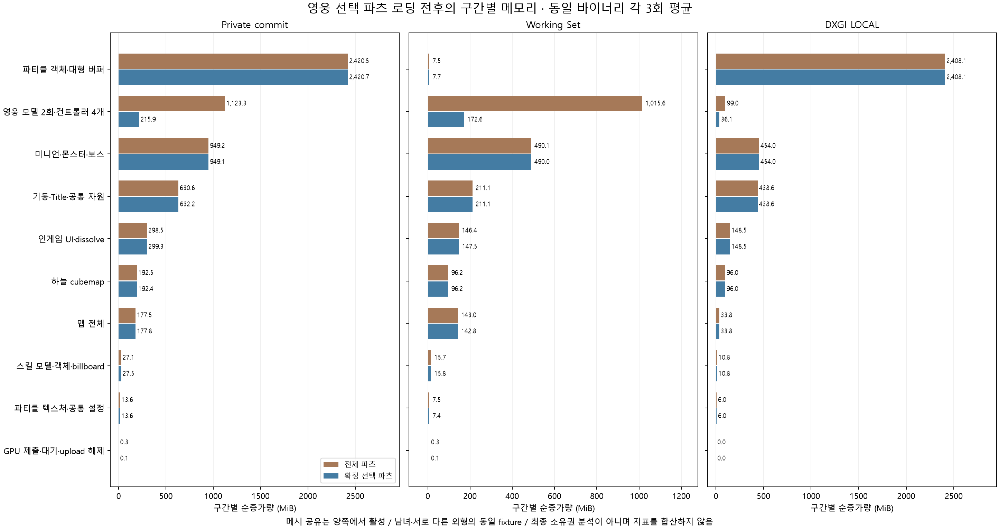
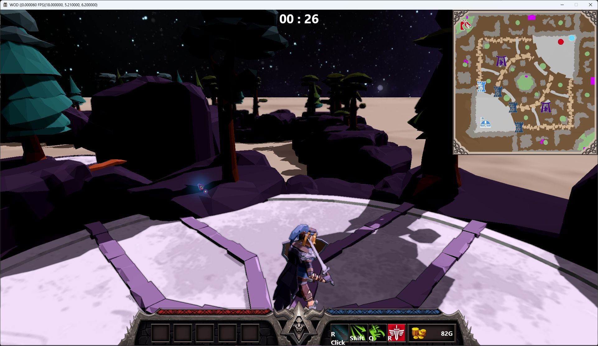

# 확정 외형을 이용한 인게임 영웅 메모리 최적화

## 문제와 원인

인게임 진입 전에 커스터마이징이 확정되지만 `ModularModel.bin`의 남녀·전체 의상·장식 파츠를 모두 생성했다. 기존 메시 공유는 base geometry의 중복을 줄였으나 스킨 wrapper·본 배열·재질·애니메이션 변환 행렬은 그대로였다. 영웅 모델은 타인용 한 계층과 로컬용 한 계층을 각각 로딩하고, 각 계층은 스킨드 메시 720개와 애니메이션 변환 대상 프레임 788개를 포함했다.

전체 모델 하나의 애니메이션 행렬은 `6,947 key × 788 frame × 64 byte = 350,351,104 byte = 334.12MiB`다. 인게임 2회 로딩은 668.24MiB이며 컨트롤러·본 배열·geometry·텍스처·할당 오버헤드는 별도다. 이 계산은 실제 플레이어 한 명이 무조건 334MiB를 독점한다는 의미가 아니다. 기존 타인용 모델은 세 영웅이 계층과 animation set을 공유한다.

## 용어와 개선 범위

이번 개선은 **선택한 외형 파츠와 이를 움직이는 공통 본·부모 프레임의 변환 행렬만 보관**하는 것이다. 모든 61개 애니메이션과 전체 6,947개 keyframe은 유지한다. 선택 스킬에 해당하는 애니메이션만 로딩하는 기능은 현재 미적용이다.

| 용어 | 이 문서에서의 의미 | 변경 여부 |
|---|---|---|
| 애니메이션 clip | 걷기·공격·스킬 등 동작 데이터의 단위 | 전체 61개 유지, 번호·길이 보존 |
| keyframe | clip의 특정 시각에 기록된 변환 값 | 전체 6,947개 유지, 시각 보존 |
| 프레임 노드 | 모델 계층의 본·부모·외형 파츠 등 변환 대상 객체 | 전체 788개 계층 노드 유지 |
| 애니메이션 변환 행렬 | 각 keyframe에 기록된 각 대상 프레임의 4×4 행렬, 64byte | 필요한 대상 프레임의 행렬만 보관 |
| 행렬 보관 대상 프레임 수 | 한 keyframe마다 행렬을 보관하는 대상 개수 | 측정 외형에서 788→로컬 107/타인 합집합 120개 |

프레임 노드 수는 재생 시간축의 keyframe 수와 다르다. 기존에는 하나의 clip의 각 keyframe에 공통 본과 **모든 외형 파츠**의 행렬을 함께 보관했다. 가능한 외형 조합마다 clip 전체를 별도로 생성한 구조는 아니다. 현재는 같은 clip의 각 keyframe에서 미선택 파츠의 행렬을 제외한다. 행렬 값의 압축·정밀도 변경은 적용하지 않았다.

```text
기존: 모든 clip → 모든 keyframe → 전체 788개 대상 프레임의 변환 행렬 보관
현재: 모든 clip → 모든 keyframe → 선택 외형 파츠 + 공통 본·부모의 변환 행렬 보관
```

외형 전달에서는 성별·파츠 번호의 확정 스냅샷을 저장하고, 이를 바탕으로 만든 `ModelPartSelection`의 포인터를 동기 로더 호출에 전달한다. 로비에서 생성한 모델 객체 포인터를 인게임으로 그대로 넘기는 구현은 아니다. 로더는 원본 파일의 keyframe 행렬을 재사용하는 임시 배열로 읽고 필요한 대상의 행렬만 복사해 보관한다. 파일 읽기량은 유지되고 모델이 보관하는 메모리가 줄어든다. 근거는 [`LoadAnimationFromFile`](../../Client/WarOfDimension/Object.cpp), [`ModelPartSelection`](../../Client/WarOfDimension/ModelPartSelection.h), [인게임 로딩 호출](../../Client/WarOfDimension/GameFramework.cpp)에 있다.

## 구현

1. `NetworkManager`가 READY의 `SC_ADD_PLAYER` 및 `SC_MODEL_CUSTOMIZE` 외형을 저장한다. 모델 객체 생성 전의 수신과 자기 자신에 대한 add packet도 기록한다. 세 영웅의 정보를 모두 수신했을 때 `GameStartPacket` 또는 인게임 진입에서 mutex로 스냅샷을 고정한다. 다음 매치의 `Reset`은 수신 상태와 스냅샷을 비운다. 미수신이면 기존 전체 모델로 fallback한다.
2. `ModelPartSelection`은 packed `ModelCustomize`의 성별과 27개 파츠 번호를 프레임 이름으로 변환한다. DB 없는 경로의 0은 미선택이고 DB 경로의 -1은 미선택이다. 타인 모델은 세 영웅의 파츠 합집합, 로컬 모델은 자기 파츠만 생성한다. 모델·패킷의 파일 형식과 필드 배치는 변경하지 않는다.
3. 프레임 노드는 전부 보존하고 미선택 파츠의 메시 GPU/CPU 배열, 스킨·본 wrapper, 재질 생성을 생략한다. 스킨·재질 skip은 잘린 레코드·음수 개수·미지원 태그를 거부한다. geometry 레코드는 기존 경계 검증을 사용한다. 공통 본, 부모 transform, 네 무기, 미지원 이름은 유지한다.
4. 모든 61개 animation clip의 번호·길이와 전체 keyframe의 시각은 보존한다. 각 keyframe에서 선택한 외형 파츠와 공통 본·부모 프레임의 변환 행렬만 보관한다. 전체 788개 프레임 계층을 유지해 본 링크와 부모 변환을 보존한다. 행렬 배열과 대상 프레임 포인터 배열은 같은 순서로 대응시킨다. 스킨의 본 배열과 애니메이션 컨트롤러는 기존 소유권을 유지하고 base geometry만 공유한다.
5. 원래 텍스처 소유 파츠가 제외된 경우 `@` 중복 참조를 실제 DDS에서 복구한다. 전체 모드와 선택 모드에 같은 복구를 적용했다. 모델 파일 핸들은 RAII로 닫는다. 인게임 생성자가 확정 외형을 기본값으로 덮어쓰거나 다시 전송하지 않도록 하고 렌더링도 스냅샷을 사용한다.

로비/READY의 편집은 전체 모델을 유지한다. 인게임에서 확정된 외형을 바꾸는 F7 개발 단축키는 막는다. Title의 4/7 및 READY 테스트는 기본 외형을 명시적으로 전달한다. 정상 매치에 테스트 기본 외형을 주입하지 않는다.

### 실제 진입 검증에서 복구한 기존 문제

Title의 로컬 테스트가 서버 응답 전 `SceneManager`를 READY로 바꿔 슬롯 ID -1로 영웅/스킬 배열을 읽거나 미생성 READY UI를 참조했다. 요청 후 Title을 유지하고 서버가 인게임 슬롯을 확정한 뒤 렌더 스레드의 한 프레임에서 READY→INGAME 기존 경로를 사용하도록 했다. 테스트 서버 전환의 `ObjectInfo[]`는 `delete[]`와 원래 로비 슬롯 용량을 사용한다.

로비의 `Job::Execute`는 `m_Func()`가 주석 처리되어 있어 패킷을 큐에서 꺼내도 실행하지 않았다. 호출을 복구하고 `Zone::AddJob`은 `shared_ptr<IJob>`를 받아 큐의 소유권 계약을 맞췄다. lambda용 `PushJob`은 호출 가능한 타입으로 제한했다. 이 변경은 wire field/packing을 바꾸지 않는다. 실제 move-only packet lambda 실행과 분할된 테스트 전환 응답은 `scripts/Test-LobbyTestTransition.py`로 확인한다. DB 없는 로컬 서버에서만 검증하며 운영 거래·인증을 검증했다고 표현하지 않는다.

[검증된 구조도와 근거](../diagrams/hero-selection/README.md) · [HTML](../diagrams/hero-selection/hero-selection.workflow.html)

## 실제 에셋 검증

`Test-HeroSelection.ps1`은 D3D12 hardware에서 전체 모델·남녀/다른 파츠 합집합 모델·로컬 선택 모델을 로딩한다. 남성 기본 외형, 여성 기본 외형, 남성 Torso 05를 fixture로 사용한다. 전체 788개 프레임 이름·순서·초기 transform, 본 링크, 재질의 텍스처 참조, 61개 clip의 key 수와 길이를 확인했다. 선택 모델이 보존한 **1,576,969개 행렬을 원본과 byte 단위로 비교해 일치**를 확인했다.

| 모델 범위 | 스킨드 메시 전체 → 선택 | 행렬 보관 대상 프레임 수 전체 → 선택 | 변환 행렬 용량 전체 → 선택 |
|---|---:|---:|---:|
| 타인 계층: 세 영웅 합집합 | 720 → 52 | 788 → 120 | 334.12 → 50.88MiB |
| 로컬 계층: 자신의 외형 | 720 → 39 | 788 → 107 | 334.12 → 45.37MiB |
| 2회 로딩 합계 | 1,440 → 91 | 1,576 → 227 | 668.24 → 96.25MiB |

행렬만 **571.99MiB(85.60%) 감소**했다. 선택 파츠 수는 실제 외형의 다양성에 따라 달라진다. 파츠 이름이 여러 프레임에서 반복되므로 27개 설정 필드와 스킨드 메시 개수는 같지 않다.

Debug·Release 전체 솔루션 빌드와 수신 전 fallback, 모델 생성 전 packet, 스냅샷의 사후 변경 방지, Reset, 남녀 합집합, 로컬 필터, 본·무기·미지원 이름, 손상된 skip 레코드 3종, 실제 계층·본·텍스처·행렬, GPU 완료 후 upload/모델 해제 검사 PASS. Debug 검증용 실행에서 발견한 Direct2D 종료 누수 중단은 정상 `OnDestroy` 호출을 추가해 해결했다. 기존 메시 공유 12개 검사와 실제 3개 에셋 GPU 감사, 일반 로컬 기동, 분할 수신한 테스트 패킷의 로비→게임 서버 전환 응답도 양 구성에서 PASS했다. 에이전트 환경·225개 compilation database 및 Serena 점검 PASS.

기존 signedness/narrowing 빌드 경고와 D3D12 resource initial state 경고는 남아 있다. 빌드 성공을 경고가 없거나 전체 게임 플레이가 검증됐다는 뜻으로 사용하지 않는다.

## 비교 시나리오와 근거

2026-10-05 KST, Release x64, NVIDIA GeForce RTX 4070 SUPER에서 같은 실행 파일의 `full`과 `selected`를 독립 프로세스로 각 3회 교대 실행한다. 양쪽 모두 geometry 공유가 활성화되어 있다. 영웅 직업 0/1/2, Ogre 보스, 같은 외형 fixture·맵·NPC·스킬·파티클을 사용한다. Title에서 실제 인게임 자원 생성 및 GPU 완료·기존 upload 해제까지 측정하고 네트워크와 loading render thread만 측정 모드에서 생략한다.

이전 메시 공유 비교의 5,770MiB와 직접 이어 붙이지 않는다. 이번에는 확정 외형 fixture와 텍스처 복구가 포함된 **동일 최종 바이너리의 전체/선택 파츠 비교**다. 예전 실행 파일을 직접 측정한 결과나 운영 서버의 네 사용자 로그인 결과로 표현하지 않는다. Private commit·Working Set·DXGI는 서로 다른 지표이며 합산하지 않는다. 생성 구간의 증가량은 최종 retained heap의 소유권 분석이 아니다.

최종 통계는 [JSON](evidence/hero-selected-parts-memory-20261005.json) · [CSV](evidence/hero-selected-parts-memory-20261005.csv)로 보존한다. 원시 실행 로그 및 source/executable SHA-256은 로컬 `artifacts/logs/hero-selected-parts-final/summary-Release.json`에 남긴다. 기존 최초 A/B·비용 분해·메시 공유 구간 비교 근거는 보존한다.

### 최종 실측: 전체 파츠와 선택 파츠

단위는 MiB이며 각 모드 3회의 평균이다. 아래는 GPU 제출·완료 대기·기존 upload 해제 후의 인게임 진입 값이다.

| 지표 | 전체 파츠 | 선택 파츠 | 감소량 | 감소율 |
|---|---:|---:|---:|---:|
| Private commit | 5,833.01 | 4,928.64 | 904.36 | 15.50% |
| Working Set | 2,133.17 | 1,291.35 | 841.83 | 39.46% |
| DXGI LOCAL usage | 3,694.88 | 3,632.02 | 62.86 | 1.70% |
| DXGI NONLOCAL usage | 823.71 | 733.76 | 89.95 | 10.92% |

영웅 생성 구간의 Private commit 증가량은 **1,123.27→215.92MiB**, 감소량은 **907.35MiB**다. 해당 구간의 Working Set은 1,015.57→172.58MiB, LOCAL은 98.96→36.10MiB다. 애니메이션 행렬을 포함한 CPU 데이터 축소가 큰 효과를 냈으며 Private commit 감소량을 VRAM 절감량으로 표현하지 않는다. 다른 구간의 할당 변동까지 포함한 최종 Private commit 감소량은 904.36MiB다. 표의 감소량은 반올림 전 byte 값으로 계산한다.

선택 파츠를 적용한 뒤에도 파티클 생성 구간의 Private commit은 **2,420.74MiB**, LOCAL은 **2,408.15MiB**로 가장 크다. 맵 구간은 **177.80MiB**다. 이번 조건에서 전체 파츠 모드의 맵도 177.49MiB로 같으므로 영웅 최적화의 효과를 맵 감소로 설명하지 않는다.



실행 파일 SHA-256은 `70f6b983225c74afe946e2fceac16f4596ee00482d0795ccb746768aed7d46f8`이다. 측정 소스 18개의 해시와 실행 파일을 확인하고 로컬 reference 사본을 보존했다. 6회 교대 실행, 동일 시나리오·파티클·모델 통계, 각 지표의 구간 합계와 최종 값, 전후 차이 합계, JSON/CSV 재생성을 검증했다. 잘못된 모드·미완료 실행·누락 구간·다른 파티클/시나리오·중복 실행 번호·틀린 baseline·불일치 모델 통계 입력 8종을 거부한다.

## 실제 인게임 화면

Release 클라이언트와 DB 없는 로비·게임 서버를 실행하고 Title의 4번 영웅 테스트로 진입했다. 클라이언트 TCP 연결이 로비 8910에서 게임 서버 8911로 전환된 것을 확인했다. 선택 모델의 영웅·무기·맵·미니맵·스킬 UI가 실제로 렌더링된 1922×1112 창 캡처다. 합성 이미지나 측정 전용 숨김 창이 아니다. 전체 전투/네 사용자 매치 검증으로 확대하지 않는다.



서버의 기존 테스트 초기화에서 `Failed To Return CoolTime 0`·`Failed To Return Mp Consumption 0` 진단이 출력됐다. 기본 스킬 번호/초기화에 대한 남은 진단으로 기록하며 정상 스킬 밸런스·모든 전투 동작 검증을 주장하지 않는다. 캡처 후 개발 프로세스는 중지했다.

## 재현

```powershell
./scripts/Build.ps1 -Module Client -Configuration Release
./scripts/Test-HeroSelection.ps1 -Configuration Debug
./scripts/Test-HeroSelection.ps1 -Configuration Release
./scripts/Measure-ClientMemory.ps1 -Configuration Release -Runs 3 -Scenario HeroParts -OutputDirectory artifacts/logs/hero-selected-parts-final
python ./scripts/Build-ClientMemoryBreakdown.py --compare-hero --summary artifacts/logs/hero-selected-parts-final/summary-Release.json --output docs/portfolio/evidence/hero-selected-parts-memory-20261005.json --charts
```

Debug 검사는 해당 구성도 먼저 빌드한다. Python 3.12 이상과 `scripts/requirements-client-memory.txt`의 matplotlib을 사용한다. GPU 측정 중 다른 게임·GPU 검증을 동시에 실행하지 않는다. 전용 진입점은 `--profile-hero-memory <report.json> full|selected`와 `--test-hero-selection <report.json>`다.

## 남은 범위

- 원본 단일 `.bin`을 순차 파싱하므로 전체 파일을 읽는 비용은 남는다. 선택 파츠 자원 생성과 변환 행렬 보관을 줄인 것이며 선택 파츠 파일만 전송하는 에셋 스트리밍을 구현한 것은 아니다. 현재 네트워크는 작은 외형 번호만 전달한다.
- 선택 스킬에 필요한 clip만 로딩하는 최적화는 미적용이다. 적용하려면 공통 동작과 스킬 연계·전환의 clip 의존 관계를 별도로 확인해야 한다.
- 스킨드 본 상태를 geometry 캐시에 합치지 않는다. 타인 세 명의 기존 공유 프레임 계층·컨트롤러 구조를 이번에 개별 소유로 재설계하지 않았다.
- 로비/READY 모델의 누적 retained 비용, 애니메이션 불변 데이터의 추가 공유, 네 무기 중 직업 무기만 선택하는 변경은 후속 후보다.
- 131개 파티클의 대형 GPU 버퍼 약 2.4GiB는 이번 변경 대상이 아니다. 선택 파츠 적용 후에도 가장 큰 다음 최적화 후보다.
- DB·블록체인 인증, 실제 네 사용자 매치, 전체 전투·매치 재진입은 별도 검증이 필요하다.
