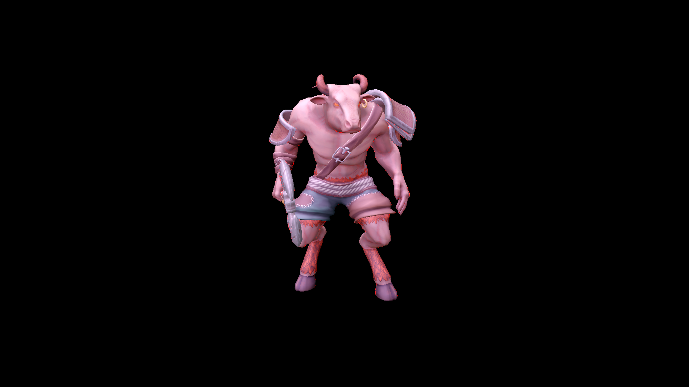

# NPC 임시 upload 회수·텍스처 압축·객체 상수 버퍼 통합

2026-10-05, 앞선 [미니언·몬스터 검토](NPC_RESOURCE_SHARING_REVIEW.md)의 1·3·4번을 적용했다. 2번 DDS 공유는 비교 양쪽에 유지했다. 누락된 임시 복사 버퍼를 GPU 완료 후 반환하고, NPC 텍스처 24장을 같은 해상도의 BC7으로 압축했으며, 미니언·일반 몬스터의 객체 상수를 프레임별 arena에 배치했다.

**동일 fixture 전후 각각 3회 측정의 중앙값에서 Private Bytes는 2,656.35→1,964.46MiB로 691.89MiB(26.05%) 감소했다.** 전체 변경의 결과이며 BC7 한 항목의 독립 성과로 해석하지 않는다. [전체 근거 JSON](evidence/npc-memory-20261005/measurements.json), [6회 측정 CSV](evidence/npc-memory-20261005/memory.csv), [품질 근거](evidence/npc-memory-20261005/quality.json), [전후 36장 비교 화면](evidence/npc-memory-20261005/gallery.html)을 함께 보존한다.

## 문제와 구현 범위

NPC 생성은 이미 모델·clip·base geometry를 공유했다. 추가 메모리 비용은 비압축 텍스처, 장면 초기화 후 남아 있는 복사용 upload, 작은 객체 CB마다 발생하는 별도 committed resource 할당이었다. 이번 변경은 애니메이션 clip을 줄이거나 다른 NPC의 pose를 공유하는 작업이 아니다.

| 번호 | 구현 | 유지하는 상태 |
|---|---|---|
| 1 | `CIngameScene::ReleaseUploadBuffers`에 미니언·몬스터·타인·타워 공격·스킬 객체/모델·파티클 텍스처 순회 추가 | DEFAULT geometry/texture, 계속 갱신하는 객체·본·파티클 상수 |
| 3 | 32bpp DDS 24장→`BC7_UNORM`, 원본 R8 Metallic 1장 유지 | 해상도·단일 mip·기존 UNORM 해석·재질 채널 배치 |
| 4 | 미니언 12개·일반 몬스터 9개의 `OBJECT_INFO`를 2프레임 arena로 통합 | draw별 world·object type·dissolve와 개별 skinning pose |

관련 구현: [Scene.cpp](../../Client/WarOfDimension/Scene.cpp), [Object.cpp](../../Client/WarOfDimension/Object.cpp), [ObjectConstantArena.cpp](../../Client/WarOfDimension/ObjectConstantArena.cpp), [SharedDdsTexture.cpp](../../Client/WarOfDimension/SharedDdsTexture.cpp), [GameFramework.cpp](../../Client/WarOfDimension/GameFramework.cpp).

## 1번: 임시 GPU 복사 버퍼 회수

기존 Framework의 GPU fence 대기가 끝난 뒤 장면의 별도 소유 컨테이너를 방문한다. 객체 계층의 vertex/index·bone index/weight와 DDS 복사용 UPLOAD를 반환한다. 공유 geometry/DDS를 다시 방문해도 해제는 멱등이고 DEFAULT 자원은 남는다. GPU가 복사에 사용하는 동안 반환하거나, 매 프레임 쓰는 상수 arena의 UPLOAD를 이 함수에서 반환하지 않는다.

최종 초기화의 `scene_gpu_complete_uploads_retained`에는 공유 DDS upload 28개, 실제 할당량 125.3125MiB가 있었다. `ingame_before_particle_use` 이후에는 **공유 DDS upload 0개·0byte**다. 이 카운터는 공용 DDS 로더 범위이며 모든 UPLOAD 자원을 뜻하지 않는다. NPC 캡처에서는 25개 고유 DDS에 임시 upload가 없고, 해제를 두 번 더 호출한 뒤에도 DEFAULT 자원으로 렌더링되는 것을 검사했다.

압축 전 NPC 고유 DDS payload 441.25MiB 전체가 임시 복사 버퍼 정리 대상이었다. 압축 후에는 113.3125MiB다. 압축과 회수의 대상이 겹치므로 두 숫자를 더해 Private 감소량으로 제시하지 않는다. vertex/bone 복사 버퍼는 이 DDS 숫자에 포함하지 않는다.

## 3번: 몬스터 텍스처 BC7과 전후 화면

Microsoft DirectXTex `may2026`의 고정 SHA-256 도구로 `-m 1 -f BC7_UNORM -bc x -gpu 0`을 사용했다. 4×4 texel을 16byte에 저장하는 BC7을 GPU에 그대로 올리므로, 32bpp 원본은 해상도를 유지하면서 payload가 1/4이 된다. 모든 변환 결과의 DDS 헤더·DXGI 형식·크기·mip·해시를 확인한 후 적용했고 LFS로 등록했다. [`Convert-NpcTextures.ps1`](../../scripts/Convert-NpcTextures.ps1)은 원본 해시가 다르면 거부한다. [공식 texconv 옵션](https://github.com/microsoft/DirectXTex/wiki/texconv), [BC7 형식](https://learn.microsoft.com/en-us/windows/win32/direct3d11/bc7-format)을 기준으로 했다.

Ogre `monster_Metallic.dds`는 이미 `R8_UNORM` 8bpp이므로 BC7 8bpp으로 바꿔도 이득이 없다. 원본 bytes와 해시를 그대로 유지했다. 해상도 축소·새 mip 생성·sRGB 강제·채널 swizzle은 적용하지 않았다. **BC7은 손실 압축이므로 채널 값이 원본과 완전히 같다는 의미는 아니다.**

| 고유 텍스처 집합 | 압축 전 payload | 적용 후 payload | 감소 |
|---|---:|---:|---:|
| FreeLich 미니언 | 12.2500MiB | 3.0625MiB | 9.1875MiB |
| Unique Red | 16MiB | 4MiB | 12MiB |
| Rare Green | 16MiB | 4MiB | 12MiB |
| Golem | 64MiB | 16MiB | 48MiB |
| Bear | 48MiB | 12MiB | 36MiB |
| Minotaur 몸통·도끼 6장 | **240MiB** | **60MiB** | **180MiB** |
| Chest·Beholder 공통 2장 | 8MiB | 2MiB | 6MiB |
| Ogre, R8 Metallic 포함 | 37MiB | 12.25MiB | 24.75MiB |
| **중복 제외 25장 합계** | **441.2500MiB** | **113.3125MiB** | **327.9375MiB** |

현재 에셋은 전부 단일 mip이며 실제 `GetResourceAllocationInfo` 합계도 위 합계와 일치했다. Chest·Beholder 공유 텍스처는 한 번만 집계한다. 앞선 DDS 공유로 제거한 8MiB는 이미 비교 양쪽에 반영되어 이번 절감에 다시 포함하지 않는다.

실제 클라이언트의 모델·재질·Deferred 셰이더로 **9종 × 앞쪽 3/4/뒤쪽 × 변경 전/후 = 36장**을 촬영했다. idle track 0초, 1920×1080, FOV 40°, 동일 포즈 bounds와 카메라 좌표·조명을 사용했다. 스크린샷 양쪽에는 1·4번이 이미 적용되어 있으며 **에셋 압축만의 시각 차이**를 비교한다. PNG는 GPU backbuffer를 readback한 원본이다. 맵·전투 UI·그림자 가림을 제외한 고정 모델 비교이며 실제 네트워크 매치 화면으로 제시하지 않는다.

| Minotaur 변경 전 | Minotaur 변경 후 |
|---|---|
|  |  |

[9종 앞·뒤 원본 크기 비교](evidence/npc-memory-20261005/gallery.html)에서 모델과 시점을 선택할 수 있다. 전후 화면에서 모델·파츠 누락이나 큰 형태 변화가 없음을 확인했다. 기존 셰이더의 강한 붉은 rim과 일부 단색 재질은 원본에서도 보인다.

DDS를 같은 RGBA32로 해석한 25장의 각 채널 MSE/PSNR/최대 오차와 실제 화면 18쌍의 RGB 오차를 [quality.json](evidence/npc-memory-20261005/quality.json)에 기록했다. 화면 통계는 검은 배경을 제외한 양쪽 foreground 합집합만 사용한다. 최저 DDS 채널 PSNR은 33.20dB, 최저 화면 채널은 33.32dB다. Minotaur 앞쪽의 RGB PSNR은 51.33/54.42/51.70dB, 최대 오차는 255단계 중 9/4/6이었다. PSNR만으로 시각 품질을 보장하지 않으며 극근접·다른 조명·모든 애니메이션의 검사는 후속 범위다. `null` PSNR은 동일 채널의 무한대 PSNR을 표현한다.

## 4번: 객체 상수 버퍼 arena

통합 대상은 위치·object type·dissolve 등을 담는 작은 객체 상수 버퍼다. geometry, 텍스처, clip 행렬이나 각 NPC의 본 변환 결과 버퍼를 합친 것이 아니다. `CMaterial::CreateShaderVariables`도 이미 만들어진 material CB를 다시 만들지 않도록 수정해 공유 material의 포인터 덮어쓰기를 막았다.

기존 미니언 300개·일반 몬스터 508개, 총 **808개 논리 CB × 64KiB = 50.5MiB**의 committed allocation을 예약했다. 새 arena는 256byte 정렬된 상수 영역을 64KiB 페이지에 모으고, 두 프레임에 각각 4페이지씩 총 **8페이지·0.5MiB**를 예약한다. 이전 미니언 단독 1프레임 제안의 0.125MiB와 달리 실제 구현은 전체 NPC·2프레임 기준이다. Ogre·영웅 등 scope 밖의 객체 CB는 이번 arena 적용 대상에 포함하지 않았다.

상수 값과 GPU 주소는 **draw마다 새 영역**에 기록한다. 같은 NPC의 그림자 draw와 본 draw도 별도 영역을 사용하므로 뒤의 기록이 앞의 명령 값을 바꾸지 않는다. 해당 프레임의 마지막 제출 fence가 끝나야 쓰기 위치를 초기화한다. 충분한 공간이 없으면 양쪽 프레임에 페이지를 추가하고 기존 GPU 주소·기록 값은 유지한다. 새 페이지 준비에 실패하면 기존 페이지를 유지한 채 오류를 전달한다.

장면 종료는 GPU 완료를 기다리고 객체의 arena 공유 참조를 반환한다. 페이지는 RAII로 Unmap/Release되며 마지막 소유자 해제 시 확장분도 회수된다. native 성장·종료 검사와 실제 캡처 후 `OnDestroy`에서 live page 0을 확인했다. 전체 기존 장면 자원의 누수 0을 의미하지 않는다. [객체 상수 수명도](../diagrams/npc-memory/README.md)에 흐름과 검증 receipt를 남겼다.

실제 종료 검증에서 기존 `UILayer::ReleaseResources`가 이미 반환된 swapchain wrapped resource를 다시 `ReleaseWrappedResources`하는 문제가 드러났다. `Render`의 Acquire/Release 짝을 유지하고 종료의 중복 반환을 제거했으며, 11-on-12 Flush 후 GPU 완료를 기다리도록 보완했다. [Microsoft의 호출 수명 설명](https://learn.microsoft.com/en-us/windows/win32/api/d3d11on12/nf-d3d11on12-id3d11on12device-releasewrappedresources)을 참조했다.

## 전체 변경의 클라이언트 메모리 실측

Windows x64 Release, RTX 4070 SUPER, 같은 영웅 확정 외형·직업 `[0,1,2,4]`·스킬 fixture와 파티클 공용 풀을 사용했다. 합성 파티클 순서를 재생한 마지막 `ingame_ready`를 비교한다. 실제 전투 최대 사용량이 아니다. 변경 전 바이너리 3회 후 변경 후 바이너리 3회를 순차 측정했으며, 하나의 바이너리에서 모드를 교대하는 A/B 실험과 구분한다.

| 지표, 3회 중앙값 | 변경 전 | 변경 후 | 감소 |
|---|---:|---:|---:|
| Process Private Bytes | 2,656.35MiB | **1,964.46MiB** | **691.89MiB, 26.05%** |
| Process Working Set | 1,233.63MiB | 897.06MiB | 336.57MiB |
| DXGI LOCAL usage | 1,518.3438MiB | 1,190.4062MiB | 327.9375MiB |

변경 전 Private 범위는 2,655.05~2,658.28MiB, 변경 후는 1,964.29~1,967.94MiB다. **Private Bytes·Working Set·DXGI LOCAL은 합산하지 않는다.** 자원별 allocation 감소량도 Process Private에 그대로 더하거나 세 변경의 독립 기여로 나누지 않는다. 파티클 보유 19쌍·재사용 30회·영웅 fixture는 양쪽에서 같음을 검사했다.

Release 실행 파일 SHA-256은 `64c50c4fa1617b904f4109088e3db8affc2be3ed32d9aada6c4d6fcb78dbda0e`, 변경 전 측정 바이너리는 `2622d1df0d6a5841e2238b777cbd46cb69d13a910bcfd97fe05a72c58f6ef356`다. 근거 JSON에는 각각의 소스 해시·측정 시각·6회 checkpoint·에셋 전후 해시·캡처 해시·검사 결과를 포함한다. 최신 원본 집계는 `artifacts/logs/npc-memory-before`와 `npc-memory-final`, 압축 전 에셋과 소스 백업은 `artifacts/logs/npc-optimization-before`에 보존했다. 로컬 백업/실행 파일은 Git에 포함하지 않는다. 과거 5.8GiB 분석 및 파티클 풀의 2,778MiB 기준선은 당시 자료로 유지한다.

## 실제 검증과 한계

| 검증 | 결과 |
|---|---|
| Client Debug/Release 빌드 | PASS, 234개 source compilation database |
| 객체 arena native, 두 구성 10개 범주 | PASS: 300 slot 예약, 600 draw 페이지 확장, 256byte 정렬, GPU readback, frame 격리, gate fence 대기, 범위/상태 오류 거부, scope 복구, material 생성 멱등, live page 0, GPU 오류/경고 0 |
| DDS native, 두 구성 12개 범주 | PASS: 압축 Chest/Beholder texture 참조 4→2, DEFAULT/UPLOAD 각각 2MiB 중복 절감, GPU 블록 readback, 반복 해제·binding 독립·마지막 소유자 0 |
| 실제 GPU 모델 캡처, 두 구성 | PASS: 9종 앞/뒤, 초기 upload 없음·반복 해제 뒤 렌더, 정상 종료 arena page 0 |
| 관련 Release 회귀 | 메시 공유 12범주/실제 모델 3종, 영웅 실제 행렬 1,576,969개 일치, 선택 파티클·공용 풀 성장/종료 PASS |
| 일반 로컬 실행 | Release 로비↔게임 TCP 연결·클라이언트 창 기동 PASS |
| 에이전트·문서 근거 | 234개 소스·Serena 핵심 3파일 색인·Archify 환경, 현재 소스/EXE/DDS/36 PNG 해시와 집계 PASS |

최종 Debug 캡처의 초기화에는 기존 D3D12 `CREATERESOURCE_STATE_IGNORED` 경고 ID 1328이 **1,511개** 기록되었다. 초기화 오류는 0이며, 캡처 렌더링과 UI 종료 구간은 오류/경고 0, device removed 0이다. DDS native에도 같은 기존 경고가 구성별 16개, 파티클 풀 native에는 기존 경고 12개가 있다. signedness/narrowing 등 기존 빌드 경고는 남는다. 경고를 숨긴 무경고 전체 실행으로 보고하지 않는다.

실제 네트워크 매치의 전체 그림자/본 렌더링·장시간 전투·모든 포즈/조명/거리·매치 재진입, 실제 장치 OOM, 운영 DB·블록체인은 미검증이다. 기존 NPC 공유 계층의 pose를 병렬 계산하는 문제와 몬스터 생성 코드 데이터화는 이번 작업에 포함하지 않았다.

## 재현

```powershell
./scripts/Build.ps1 -Configuration Release -Module Client
./scripts/Build.ps1 -Configuration Debug -Module Client
./scripts/Test-ObjectConstants.ps1 -Configuration Debug
./scripts/Test-ObjectConstants.ps1 -Configuration Release
./scripts/Test-DdsSharing.ps1 -Configuration Debug
./scripts/Test-DdsSharing.ps1 -Configuration Release
./scripts/Capture-Monsters.ps1 -Configuration Release -OutputDirectory artifacts/logs/npc-recheck
./scripts/Measure-ClientMemory.ps1 -Configuration Release -Scenario ParticleReuse -Modes pooled -Runs 3 -OutputDirectory artifacts/logs/npc-recheck-memory
./scripts/Test-AgentEnvironment.ps1
./scripts/Test-Local.ps1 -Configuration Release
```

`Convert-NpcTextures.ps1`에는 압축 전 파일을 가진 별도 `-SourceDirectory`를 전달한다. 현재 압축 에셋을 다시 입력하면 원본 해시 검사로 거부한다. 고정 도구 release/해시는 근거 JSON에 있으며 `texconv.exe`는 로컬 `artifacts/tools/directxtex-may2026`에 준비한다. 변환 도구를 새로 받을 때 동일 공식 release와 해시를 확인한다.

RGBA로 해석한 전후 DDS를 `artifacts/logs/npc-texture-decoded/before|after`에 준비한 뒤 `Analyze-NpcOptimization.py --after artifacts/logs/npc-bc7-final --output artifacts/logs/npc-quality-final.json`으로 품질을 계산한다. `Build-NpcOptimizationEvidence.py`는 보존한 원시 집계·품질·검사·캡처를 검증하고 공개 JSON/CSV/PNG를 재생성한다. Python에는 NumPy·Pillow가 필요하다. 공개 JSON만으로 수치 집계와 PNG 해시를 검산할 수 있으나, 이전 바이너리 재실행에는 로컬 백업 또는 해당 소스 상태의 재빌드가 필요하다.
