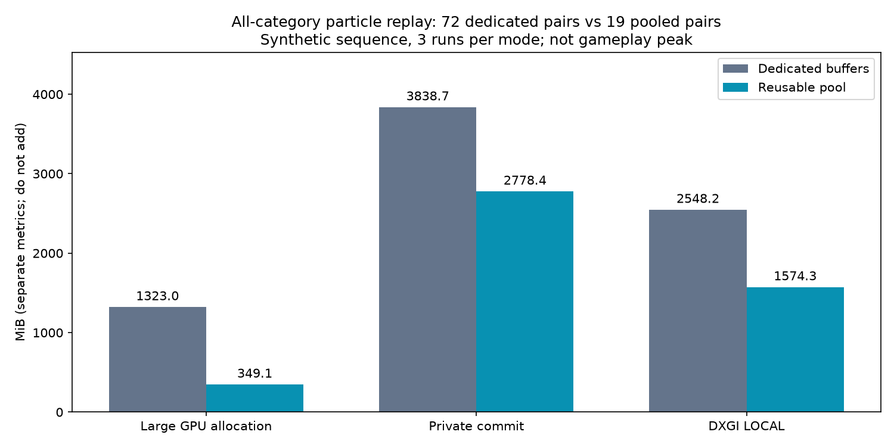
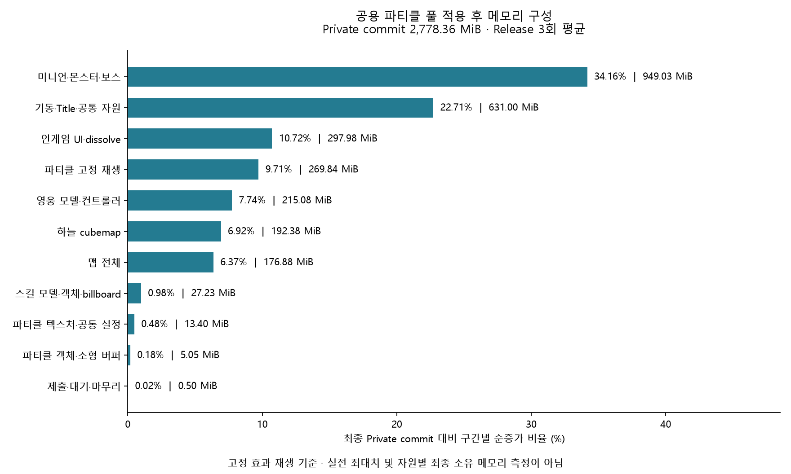

# 모든 파티클의 공용 GPU 버퍼 재사용·확장·종료 해제

## 문제와 구현 결과

[선택 스킬 최적화](PARTICLE_SELECTED_SKILLS.md) 이후에도 효과 객체마다 최대 300,000개 입자를 위한 Stream Output/Draw 버퍼를 미리 만들었다. 고정 조합의 스킬 45개·선택 슬롯 8개·환경 19개, 총 72개 객체의 대형 GPU allocation은 1,323MiB였다. 아직 재생하지 않은 효과도 동일한 비용을 예약했다.

2026-10-05 구현은 **모든 파티클 효과가 하나의 장면 공용 풀에서 대형 버퍼 쌍을 임대**하도록 변경했다. 스킬·타워·슬롯 버프/이동·점프·코인·장벽에 동일하게 적용한다. 효과 객체와 서버 ID의 논리 슬롯은 유지하며, 동시 효과마다 다른 버퍼를 임대해 위치·속도·수명을 독립적으로 보관한다. 동일한 영역을 동시에 덮어쓰는 공유가 아니다.

실제 게임 Shader를 이용한 고정 재생에서 대형 버퍼는 **72쌍→19쌍, 1,323.000→349.125MiB**로 감소했다. 감소량은 **973.875MiB / 73.61%**다. 이 결과는 아래 합성 재생 순서의 결과이며 실전 최대 동시 효과 수나 항상 유지되는 게임 메모리 상한을 뜻하지 않는다.

## 버퍼를 빌리고 돌려주는 과정

`CIngameScene::BuildObjects`가 장면 공용 `ParticleBufferPool`을 만들고 모든 `CParticleObject`에 전달한다. 메시 객체 생성 시에는 작은 emitter 정점·개별 상수·출력 카운터·통계 자원을 준비한다. 두 대형 버퍼는 최초 렌더링 시 임대한다. 텍스처·난수 텍스처·Shader의 기존 공유는 유지한다.

`CScene::RenderParticle`은 모든 종류의 비활성 효과를 먼저 반환한다. 이어서 활성 효과가 stride와 용량이 맞는 완료된 유휴 블록 중 가장 작은 블록을 찾는다. 없으면 새로운 버퍼 쌍을 추가한다. 예를 들어 스킬에 쓰던 저장 공간을 종료 후 코인 효과에 사용할 수 있다. 새 효과는 자신의 emitter seed와 입자 수·출력 카운터를 초기화하므로 이전 효과의 입자가 남지 않는다.

실제 GPU 사용을 기록한 블록에는 해당 프레임의 fence 값이 붙는다. command list 제출 뒤 공용 풀의 단조 증가 fence에 signal하고, 해당 값이 완료되기 전에는 반환된 블록도 재임대하지 않는다. 출력 통계 readback 역시 이 fence 완료 후 읽는다. 풀은 렌더 스레드에서 관리하며 네트워크 수신 스레드가 GPU 자원을 할당하지 않는다.

구현 근거: [ParticleBufferPool](../../Client/WarOfDimension/ParticleBufferPool.cpp), [CParticleMesh](../../Client/WarOfDimension/Mesh.cpp)의 `PrepareBuffers`·`ReturnBlock`·`ParticlePostRender`, [CParticleObject](../../Client/WarOfDimension/Object.cpp)의 `Render`, [CScene](../../Client/WarOfDimension/Scene.cpp)의 `RenderParticle`·`OnPostRenderParticle`.

## 풀과 개별 입자 영역의 확장

| 부족한 대상 | 구현한 처리 |
|---|---|
| 동시에 사용하는 효과의 버퍼 쌍 | 호환되는 빈 블록이 없으면 공용 풀에 새 쌍을 추가한다. |
| 한 효과의 입자 용량 | SO 통계의 출력 수/필요 수를 읽어 현재 용량 도달·초과를 감지하고 다음 프레임에 `max(현재 용량 × 2, 필요한 용량)` 이상의 블록을 임대한다. |
| 확장 전 상태 | 실제 기록된 입자와 입자 수를 유지해 새 Draw 버퍼로 복사하고, 기존 블록은 복사 명령까지 끝난 뒤 재사용할 수 있게 반환한다. |
| GPU 할당 실패 | 부분 할당은 `ComPtr`로 회수한다. 확장 실패는 기존 버퍼와 상태를 유지하며 다음 프레임에 다시 시도한다. 최초 임대 실패는 해당 효과의 그 프레임 GPU 재생을 생략하고 실패 횟수·디버그 진단을 남긴다. |

초기 입자 용량은 기존 300,000개다. 각 버퍼 view의 byte 크기 범위를 넘는 요청은 거부한다. 전체 풀에 고정된 효과 개수 상한을 새로 두지 않았으며 실제 할당은 장치의 메모리 가용량에 영향을 받는다. 별도 게임 메모리 예산·장식 효과 품질 조절은 이번 구현에 포함하지 않았다.

이전 `m_nVertices >= MAX_PARTICLES`에서 전체 효과를 재시작하던 처리를 제거했다. 다만 출력 통계는 사후 정보이므로 포화된 그 프레임에 기록되지 않은 입자를 복구하지는 않는다. **다음 프레임 확장은 실제 보존된 입자 상태를 유지하며, 그 프레임의 초과 생성분은 생략될 수 있다.** 이 경우 `OverflowCount`로 검출한다. 생성량 사전 예측·같은 프레임 재실행은 미구현이다.

확장 순간에는 이전 버퍼와 새 버퍼를 함께 보유한다. 반환된 블록도 다음 효과를 위해 풀에 유지하므로 실행 중 최고 수요 이후 즉시 메모리가 줄지는 않는다. 유휴 풀 축소·장면 중 메모리 압박 대응은 후속 개선 범위다.

## 게임 종료와 장면 전환

`CGameFramework::OnDestroy`와 `ChangeSceneReleaseObject`는 자원 정리 전에 GPU를 기다린다. 인게임 `ReleaseObjects`와 `ReleaseParticles`도 풀 자체의 fence를 기다려 마지막 파티클 제출 완료를 직접 보장한다.

그 뒤 효과 객체를 삭제하면서 임대를 반환하고, 장면의 공용 풀을 해제한다. 풀은 모든 블록을 `unique_ptr`와 `ComPtr`로 소유하므로 최초 할당분·실행 중 확장분·유휴분을 함께 회수한다. 전역 캐시에 보존하지 않는다. `ReleaseParticles`를 두 번 호출해도 안전하며, 전용 수명 검사에서는 전체 풀의 잔여 대형 버퍼 쌍이 0인지 확인한다.

## 동일 바이너리 비교

Release RTX 4070 SUPER, 각 모드 3회 독립 프로세스에서 교대 측정했다. 같은 실행 파일의 `dedicated`는 72개 객체에 대형 버퍼를 선할당하고, `pooled`는 공용 풀에서 실제 표시 시 임대한다. 선택 외형·geometry 공유·네 참가자의 선택 조합·실제 파티클 Shader와 재생 순서는 양쪽이 같다. 실행 파일 SHA-256은 `ced83cfa0ae04e77b58bffae130da6e716398f573ee06976f8a9123c8c557fac`다.

재생 순서는 각 단계 2프레임씩 총 10프레임이며, 네트워크를 사용하지 않는 합성 입력이다.

| 단계 | 활성 효과 | 공용 풀의 보유 쌍 | 누적 재사용 |
|---|---:|---:|---:|
| 스킬 | 4 | 4 | 0 |
| 점프·코인·장벽 전체 | 19 | 19 | 4 |
| 선택 슬롯 전체 | 8 | 19 | 12 |
| 모두 비활성 | 0 | 19 | 12 |
| 스킬 9 + 슬롯 4 + 환경 5 | 18 | 19 | 30 |

효과 객체 72개는 그대로 존재한다. 마지막 공용 풀은 임대 중 18쌍·유휴 1쌍이며 종료 시 19쌍 전부 해제된다. 네 참가자 입력은 이전 선택 스킬 비교와 같지만 이번에는 실제 Shader 재생을 추가했으므로 이전 실측 절대값을 이어 붙이지 않는다.

| 지표 | 선할당 평균 | 공용 풀 평균 | 감소 |
|---|---:|---:|---:|
| 대형 GPU 버퍼 allocation | 1,323.000MiB | 349.125MiB | 973.875MiB / 73.61% |
| 대형 버퍼 payload | 1,318.36MiB | 347.90MiB | 970.46MiB |
| 프로세스 Private commit | 3,838.65MiB | 2,778.36MiB | 1,060.29MiB / 27.62% |
| Working Set | 1,289.75MiB | 1,289.69MiB | 0.06MiB |
| DXGI LOCAL | 2,548.22MiB | 1,574.34MiB | 973.875MiB / 38.22% |

서로 다른 메모리 지표는 합산하지 않는다. Private commit 감소 전부를 GPU 버퍼의 retained heap 비용으로 귀속하지 않는다. 재생 전에 최초 로딩만 측정하면 공용 풀 대형 버퍼는 0쌍이지만, 정상 게임은 환경 효과를 표시하므로 그 값을 실전 사용량으로 제시하지 않는다.



[결과 JSON](evidence/particle-buffer-pool-20261005.json) · [CSV](evidence/particle-buffer-pool-20261005.csv) · [원시 실행 근거](evidence/particle-buffer-pool-runs-20261005.json) · [GPU 수명 검사](evidence/particle-buffer-pool-gpu-tests-20261005.json) · [구조도](../diagrams/particle-buffer-pool/README.md)

측정 소스 28개, 추가 Shader·테스트 근거 5개와 실행 파일을 `artifacts/logs/particle-buffer-pool-final/reference-sources` 및 `reference-WarOfDimension.exe`에 보존했다. 이전 단계의 측정·reference도 유지한다.

## 검증과 재현

Debug/Release 클라이언트 빌드와 WARP 실제 GPU 검사에서 동시 임대 격리, 종류 간 재사용, 미완료 fence의 재사용 방지, 풀 추가 생성, 4개 입자 용량의 포화 검출·12개 용량 확장, 실제 GPU 상태 보존, 새 효과의 seed/counter 초기화, 2회 생성·종료 후 잔여 쌍 0을 확인했다. GPU 오류 0, 경고는 각 12개이며 경고를 제거했다고 주장하지 않는다. 할당 범위 초과 요청의 거부를 확인했으며 실제 장치 OOM 유발은 검사하지 않았다.

실제 게임 Shader의 전체 종류 고정 재생과 반복 `ReleaseParticles` 검사, 선택 파티클 회귀, 메시 공유 12개 및 실제 에셋 3종, 영웅 실제 행렬 1,576,969개 일치, Debug 로컬 서버·클라이언트 창 기동, compilation database 229개·Serena 색인을 확인했다. 기존 signedness/narrowing·swprintf·D3D12 관련 경고는 남는다. 입력 변조 6종 거부와 byte 합계·현재 소스/바이너리 해시를 검사했다.

```powershell
./scripts/Build.ps1 -Configuration Debug -Module Client
./scripts/Build.ps1 -Configuration Release -Module Client
./scripts/Test-ParticleBufferPool.ps1 -Configuration Debug
./scripts/Test-ParticleBufferPool.ps1 -Configuration Release
./scripts/Measure-ClientMemory.ps1 -Configuration Release -Scenario ParticleReuse -Runs 3 -OutputDirectory artifacts/logs/particle-buffer-pool-new
python ./scripts/Build-ParticleBufferPoolReport.py --summary artifacts/logs/particle-buffer-pool-new/summary-Release.json --output artifacts/logs/particle-buffer-pool-report.json --verify-current --charts
```

실행 가능한 Python과 matplotlib이 필요하다. GPU 검사와 메모리 측정을 동시에 실행하지 않는다. 기존 reference 폴더를 출력 경로로 재사용하지 않는다. 네 사용자 실전 최대 중첩·모든 스킬의 장시간 시각 품질·전체 매치 재진입·DB/블록체인은 미검증이다. 서버의 기존 ArrowRain/DarknessRay ID 충돌과 풀 고갈 반환 문제는 이 클라이언트 자원 작업에서 변경하지 않았다.

## 최적화 후 클라이언트 메모리 구성 비율

이 표·차트는 DDS 공유 적용 전 공용 파티클 풀의 확정 3회 측정이다. 이후 [모델 DDS 공유 구현·검증](NPC_RESOURCE_SHARING_REVIEW.md#후속-적용-모델-dds-공유), [NPC upload 회수·BC7·상수 arena](NPC_MEMORY_OPTIMIZATION.md)를 적용했다. 최신 후속 실측은 Private 중앙값 1,964.46MiB이며 기존 근거는 당시 기록으로 보존한다. 서로 다른 시점의 측정을 이 비율표에 섞지 않는다.

2026-10-05의 동일 최종 바이너리 `pooled` 3회 원시 측정을 다시 집계했다. 새 게임 실행 측정이 아니며, 집계 당시 커밋 `38bb9ee7`에 포함된 계측 소스 28개와 Release 실행 파일의 SHA-256 일치를 확인했다. **고정 효과 재생 후 Private commit은 2,778.36MiB(약 2.71GiB)**다. Working Set은 1,289.69MiB, DXGI LOCAL은 1,574.34MiB이며 세 지표는 합산하지 않는다.

아래 비율은 각 로딩/재생 checkpoint 사이의 **Private commit 순증가량 ÷ 최종 Private commit**이다. 자원별 최종 소유 메모리를 직접 추적한 heap 분석이 아니다. 기동 행은 프로세스 초기값을 포함하고, 각 실행의 전체 구간 합계가 최종 byte 값과 정확히 일치함을 검증했다.

| 생성·재생 구간 | Private 순증가 (MiB) | 최종 사용량 대비 |
|---|---:|---:|
| 미니언·몬스터·보스 | 949.03 | 34.16% |
| 기동·Title·공통 자원 | 631.00 | 22.71% |
| 인게임 UI·dissolve | 297.98 | 10.72% |
| 파티클 고정 재생 | 269.84 | 9.71% |
| 영웅 모델·컨트롤러 | 215.08 | 7.74% |
| 하늘 cubemap | 192.38 | 6.92% |
| 맵 전체 | 176.88 | 6.37% |
| 스킬 모델·객체·billboard | 27.23 | 0.98% |
| 파티클 텍스처·공통 설정 | 13.40 | 0.48% |
| 파티클 객체·소형 버퍼 | 5.05 | 0.18% |
| GPU 제출·대기 | 0.50 | 0.02% |
| **합계** | **2,778.36** | **100%** |

현재 가장 큰 구간은 미니언·몬스터·보스 **34.16%**, 맵은 **6.37%**, 영웅 모델·컨트롤러는 **7.74%**다. 파티클 준비·객체·고정 재생 세 구간 합계는 288.29MiB / 10.38%다. 파티클 GPU 대형 버퍼 allocation 349.125MiB는 별도 지표이므로 이 Private 비율표에 대입하거나 합산하지 않는다.

효과를 한 번도 재생하지 않은 로딩 완료 시점은 2,508.52MiB이고 대형 파티클 버퍼가 0쌍이다. 실제 표시를 반영한 고정 재생 후에는 19쌍을 보유하며 2,778.36MiB다. 정상 게임에서 환경 효과가 표시되므로 재생 전 값을 플레이 사용량으로 제시하지 않는다. 실전 동시 효과 수·확장 이력에 따라 풀 보유량과 메모리는 달라진다.



[세부 JSON](evidence/client-memory-current-share-20261005.json) · [CSV](evidence/client-memory-current-share-20261005.csv) · [SVG](evidence/figures/client-memory-current-share.svg). 이전 5.8GiB 분석과 측정 시나리오가 다르므로 비율/절대값을 직접 이어 붙이지 않는다. 이전 비교는 당시 기록으로 보존한다.

```powershell
python scripts/Build-CurrentClientMemoryShare.py --summary docs/portfolio/evidence/particle-buffer-pool-runs-20261005.json --output artifacts/logs/current-memory-share.json --charts
```

구간 순서·중복·누락·반복 번호의 잘못된 입력 4종 거부, 지표별 byte 합계 및 비율 합계 검증 PASS. PNG의 한글·레이블·잘림 여부를 직접 확인했다. 게임 코드 변경이 없어 빌드·전투 실행은 반복하지 않았다.
