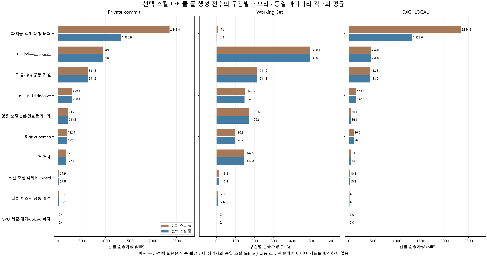

# 선택 스킬에 필요한 파티클 버퍼만 생성

이 문서는 종류별 선할당을 줄인 이전 단계의 구현·실측 기록이다. 후속 [전체 파티클 공용 GPU 풀](PARTICLE_BUFFER_POOL.md)에서 GPU 버퍼 생성 시점과 소유권을 변경했다. 아래 127→72개 측정 근거는 당시 조건 그대로 보존한다.

## 문제와 원인

이전 클라이언트는 선택한 스킬과 관계없이 `NumParticle(SKILL_TYPE)`이 반환하는 모든 종류의 풀을 생성했다. 현재 설정의 20종류에 각각 `MAX_SKILL_OBJECT=5`개가 있어 100개 파티클 객체가 만들어졌다. 별도로 네 참가자의 선택 슬롯 효과와 점프·코인·장벽 효과도 생성한다. [이전 비용 분해](CLIENT_MEMORY_BREAKDOWN.md)에서 약 2.4GiB로 확인한 비용의 주요 원인은 이 풀의 대형 GPU 버퍼였다.

`CParticleMesh` 하나는 최대 300,000개 정점, 정점당 32byte의 stream-output 버퍼와 draw 버퍼를 각각 소유한다. 실제 활성 파티클 수가 작아도 두 버퍼의 전체 용량을 예약한다.

```text
객체당 payload = 300,000 × 32 × 2 = 19,200,000byte = 18.31055MiB
RTX 4070 SUPER에서 실제 두 버퍼 allocation = 18.375MiB
```

## 선택한 설계

인게임 진입 시 네 참가자의 직업과 각 네 스킬 번호를 고정한다. 자신의 선택만 사용하면 다른 참가자의 공격이 누락되므로 전체 참가자의 선택 합집합을 사용한다. `ParticleSelection`은 선택 스킬이 만드는 종류에 직업별 기본 공격, 항상 필요한 타워 공격, BigBang의 `WIZARD_BIGBANG_CONTINUE` 후속 효과를 더한다. ArrowRain·StormArrow의 타이머 효과도 포함한다.

필요한 종류마다 기존 다섯 인스턴스를 유지한다. 같은 스킬을 여러 슬롯에서 선택해도 종류 판별은 중복되지 않는다. 각 인스턴스는 가변 stream-output/draw 버퍼를 개별 소유하며 파티클 버퍼를 geometry 내용 캐시에 넣지 않는다. 기존 용량과 서버의 동시 스킬 객체 수 계약은 유지한다.

선택 슬롯별 버프·이동 효과는 원래 선택 번호로 생성하던 경로를 유지한다. 점프 6개, 코인 9개, 장벽 4개와 스킬 모델·스킬 객체 풀, 15개 공용 파티클 텍스처도 유지한다. 선택 정보가 미완료이거나 범위를 벗어나면 종류별 풀은 기존 전체 풀로 fallback한다. 미수신 슬롯 효과를 추측해 생성하지 않는다.

[변경 workflow HTML](../diagrams/particle-selection/particle-selection.workflow.html)과 [JSON·검증 근거](../diagrams/particle-selection/README.md)를 함께 관리한다. 작성 내용은 한글이며 고정 Viewer UI와 HTML `lang`은 영어다.

## 구현과 전송 순서

| 변경 | 구현 근거 |
|---|---|
| 직업·선택 스킬 스냅샷과 의존 종류 판별 | [ParticleSelection.h](../../Client/WarOfDimension/ParticleSelection.h), [ParticleSelection.cpp](../../Client/WarOfDimension/ParticleSelection.cpp) |
| 범위 검사, mutex로 저장·고정·초기화, 매치 중 사후 변경 무시 | [NetworkManager.cpp](../../Client/WarOfDimension/NetworkManager.cpp)의 `StoreReadySkill`, `StoreReadyJob`, `FreezeIngameSkills`, `Reset` |
| 필요 종류 풀만 생성, 없는 풀을 삽입하지 않는 렌더 조회와 인덱스 검사 | [Scene.cpp](../../Client/WarOfDimension/Scene.cpp)의 `CIngameScene::BuildObjects`, `Render` |
| 공용 텍스처의 씬 소유 참조, material의 텍스처·shader 참조 중복 제거 | [Scene.cpp](../../Client/WarOfDimension/Scene.cpp), [Object.cpp](../../Client/WarOfDimension/Object.cpp)의 `CParticleObject` |
| 객체·텍스처·ParticleInfo의 해제 경로 분리와 빈 풀의 반복 해제 | `CIngameScene::ReleaseParticles`, `CGameFramework::ProfileReleaseParticles` |
| 자동 선택 결과를 게임 시작 전에 전송 | [CMatch.cpp](../../Server/Game_Server/CMatch.cpp)의 `ReadyUpdate` |
| 보스의 직업 4·5를 스킬 표의 0·1로 정규화하고 자동 선택 응답 번호 수정 | [CGameMgr.cpp](../../Server/Game_Server/CGameMgr.cpp)의 `SkillAutoSelect` |

이전 서버는 게임 시작 패킷을 먼저 보내고 자동 선택을 수행했다. 클라이언트가 선택을 기준으로 버퍼를 만들려면 반대 순서가 필요하다. 같은 연결에서 선택 결과를 모두 보내고 `SC_GAME_START`를 보낸다. 또한 보스 자동 선택의 SC 번호를 수동 선택과 같은 21..40으로 맞췄다. CS 보스 번호는 20..39, 서버 handler 번호는 96..115다. 패킷 상수·길이·필드·packing은 변경하지 않았다. 클라이언트와 게임 서버를 함께 갱신한다. 이전 서버와의 조합에서 정보가 불완전하면 전체 종류 풀을 사용하므로 최적화가 적용되지 않을 수 있다.

원래 파티클 생성자는 `CMaterial::SetTexture/SetShader`에서 획득하는 참조 외에 한 번씩 더 참조를 증가시켰다. 중복 증가를 제거하고 텍스처에는 명시적인 씬 소유 참조를 둬 일부 종류를 생략해도 사용 중인 텍스처를 조기 해제하지 않도록 했다. random 값의 CPU 임시 배열도 자동 수명 배열로 바꿨다. 두 비교 모드에는 동일한 소유권 수정이 적용되어 있다.

## 동일 조건의 측정

2026-10-05 Windows x64 Release, NVIDIA GeForce RTX 4070 SUPER에서 같은 최종 실행 파일의 전체/선택 풀을 각 3회 독립 프로세스로 교대 측정했다. geometry 공유와 영웅 선택 외형 최적화는 양쪽에서 활성이다. 남녀·다른 torso의 외형 fixture도 양쪽에서 같으며, 영웅 스킨드 메시 91개·애니메이션 열 227개·행렬 100,926,016byte가 일치한다. 다른 GPU 검증과 동시에 측정하지 않았다.

이전 커밋의 실행 파일을 직접 비교한 결과가 아니라, 현재 바이너리에서 이전 전체 종류 풀 생성 경로를 재현한 비교다. 원본 기준 커밋은 `ee60ac1687a83b6830ee573c618b7f7ac4d82b4d`이고 구현·계측 변경을 포함한 작업 트리에서 빌드했다. 최종 실행 파일과 계측 소스 해시는 [원시 실행 근거](evidence/particle-selected-skills-runs-20261005.json)에 있다. 로컬 `artifacts/logs/particle-selected-skills-verified/reference-sources`와 `reference-WarOfDimension.exe`에 계측 소스 24개와 실행 파일을 보존한다.

| 참가자 | 직업 번호 | 확정 스킬 번호 |
|---|---:|---|
| 영웅 1 | 0 / Archer | 48, 53, 54, 58 |
| 영웅 2 | 1 / Fighter | 60, 65, 69, 70 |
| 영웅 3 | 2 / Swordman | 72, 79, 81, 82 |
| 보스 | 4 / Ogre | 24, 27, 29, 30 |

이 조합의 종류별 풀은 Archer 기본 공격·PenetraitingShot·StickyArrow·PhoenixArrow, Fighter FireBall, Swordman AuraBlade·JudgementSword, Ogre DimensionCrush, 타워 공격의 9종류다. Ogre 기본 공격은 유지 대상으로 판별하지만 기존 설정의 파티클 수가 0이므로 GPU 버퍼를 생성하지 않는다. 슬롯별 효과 8개와 환경 19개는 양쪽에서 동일하다.

| 실제 생성·할당 | 전체 종류 풀 | 선택 종류 풀 | 감소 |
|---|---:|---:|---:|
| 종류별 스킬 풀 객체 | 100 | 45 | 55 |
| 선택 슬롯 효과 | 8 | 8 | 0 |
| 환경 효과 | 19 | 19 | 0 |
| 총 파티클 객체 | 127 | 72 | 55 / 43.31% |
| 대형 버퍼 2개 합계 payload | 2,325.44MiB | 1,318.36MiB | 1,007.08MiB |
| D3D12 allocation 합계 | 2,333.625MiB | 1,323.000MiB | 1,010.625MiB |

실제 `ID3D12Resource::GetDesc().Width`와 `GetResourceAllocationInfo`를 계측했다. 총 객체 수 × 300,000 × 32 × 2와 payload byte가 일치하며, 다섯 인스턴스와 정점 용량은 줄이지 않았다.

| 인게임 진입 평균 | 전체 종류 풀 | 선택 종류 풀 | 감소 |
|---|---:|---:|---:|
| Private commit | 4,857.28MiB | 3,837.25MiB | 1,020.02MiB / 21.00% |
| Working Set | 1,292.15MiB | 1,287.61MiB | 4.53MiB / 0.35% |
| DXGI LOCAL | 3,558.49MiB | 2,547.44MiB | 1,011.05MiB / 28.41% |

파티클 생성 구간의 Private commit 순증가량은 2,348.42→1,330.85MiB다. 전체 진입 Private commit은 21.00% 감소했다.



[수치·각 실행 checkpoint JSON](evidence/particle-selected-skills-20261005.json) · [CSV](evidence/particle-selected-skills-20261005.csv) · [원시 실행 근거](evidence/particle-selected-skills-runs-20261005.json) · [SVG](evidence/figures/particle-selected-skills-memory.svg)

Private commit, Working Set, DXGI LOCAL은 각각 다른 지표이며 합산하지 않는다. 구간 증가량은 최종 heap 소유권 분석이 아니다. 큰 DEFAULT GPU 버퍼의 예약 감소에 비해 CPU Working Set 감소가 작을 수 있다. 이전 외형 측정의 131개 파티클과 이번 127개는 선택 슬롯 fixture가 다르므로 이전 절대값에서 이번 감소량을 빼서 결과를 만들지 않는다.

## 검증 결과와 재현

- Debug/Release 전체 빌드 PASS. compilation database 227개 소스, Serena 신규 선택 파일 색인과 에이전트 환경 PASS.
- `Test-ParticleSelection.ps1`: 종류별 100→45, 타인 스킬·기본 공격·타워·Wizard/BigBang 후속·Archer 타이머·Programmer·중복 선택, 16개 미완료 슬롯, 잘못된 범위, 스냅샷 고정과 매치 초기화 PASS.
- 두 구성의 실제 인게임 GPU 자원 생성·제출·대기 및 풀 해제 두 번 PASS. 측정 report의 `particleReleaseChecked=true`로 확인한다. 진입 메모리는 해제 직전의 `ingame_ready` checkpoint를 사용한다.
- 실제 로비 매칭으로 연결한 네 TCP 클라이언트에서 Ogre/Programmer 각각 Debug/Release PASS. 수동 선택 보존, 자동 선택의 영웅/보스 범위와 궁극기 번호, 네 직업·16개 스킬이 게임 시작 전에 수신됨, 분할 READY header 확인.
- 기존 Release 영웅 선택 파츠의 원본 대비 행렬 1,576,969개 일치와 메시 공유 기본 12개 검사·실제 3종 에셋 GPU 감사 PASS. Debug 일반 로컬 서버 연결·클라이언트 게임 창 기동 PASS.
- 실제 byte 합계, 반복 횟수·fixture·버퍼 용량 일치, JSON/CSV 재생성과 소스/실행 파일 reference 해시 확인 PASS. 잘못된 측정 입력 9종 거부 PASS.
- Archify showcase 9/9, 오류/경고 0 및 네 해상도 자동 검사와 light/dark 직접 화면 점검 PASS.

```powershell
./scripts/Build.ps1 -Configuration Debug -Module All
./scripts/Build.ps1 -Configuration Release -Module All
./scripts/Test-ParticleSelection.ps1 -Configuration Debug
./scripts/Test-ParticleSelection.ps1 -Configuration Release
./scripts/Measure-ClientMemory.ps1 -Configuration Release -Scenario ParticleSkills -Runs 3 -OutputDirectory artifacts/logs/particle-selected-skills-new
python ./scripts/Build-ClientMemoryBreakdown.py --compare-particles --summary artifacts/logs/particle-selected-skills-new/summary-Release.json --output artifacts/logs/particle-selected-skills-report.json --charts
```

Python 3.12 이상의 실제 설치와 그래프용 matplotlib을 사용한다. 기존 계측 reference 폴더를 재측정 출력 경로로 쓰지 않는다. 네트워크 검사는 새 로컬 서버에서 보스별·구성별로 실행하며 Python의 종료 코드가 0이어야 한다.

```powershell
./scripts/Start-Local.ps1 -Configuration Release -ServersOnly
try { python ./scripts/Test-ParticleSelectionNetwork.py --boss-job 4 --output artifacts/logs/test-particle-network-ogre-Release.json }
finally { ./scripts/Stop-Local.ps1 }
# Programmer는 새 서버에서 --boss-job 5로 실행한다.
```

## 한계와 후속 개선

종류마다 유지한 5개는 서버의 0~4번 스킬 객체 ID를 지원하는 기존 풀 크기이며 실전에서 검증한 최적 동시 효과 수는 아니다. [종류별 필요성 검토](PARTICLE_POOL_CAPACITY_REVIEW.md)에 타워 미사용 슬롯, 시전자 ID 경로, 중첩 투사체, 기존 효과 ID 충돌·풀 고갈 문제와 최초 사용 시 GPU 버퍼 생성 제안을 정리했다. 이 단계에서는 용량·생성 시점 개선이 미구현이었으며 아래 실측은 그대로 유지한다. 현재 후속 구현은 공용 풀 문서를 참조한다.

절감량은 참가자의 직업·선택 스킬 합집합에 따라 달라진다. 선택 정보가 미완료이면 전체 종류 풀을 유지한다. 현재 각 객체의 300,000개 용량 때문에 이 조합에서도 대형 버퍼 allocation이 약 1.29GiB 남는다. 종류별 최대 실제 입자 수에 맞춘 용량 조정은 별도 개선 후보이며 이번에는 변경하지 않았다.

이번 검증은 선택 의존 관계·실제 자원 생성과 해제·전송 순서를 확인했다. 모든 스킬을 실제 전투에서 동시에 재생한 시각 검사, 매치 재진입 전체 수명, DB·블록체인 기능은 미검증이다. 서버 자동 선택의 기존 보스 일반 스킬 중복 선택 문제와 기존 signedness/narrowing·swprintf·D3D12 initial state 경고도 남는다. 원본 에셋·애니메이션 clip, 스킬 모델 객체 풀을 줄인 결과로 해석하지 않는다. 커밋·push는 별도 요청에 따라 진행한다.
